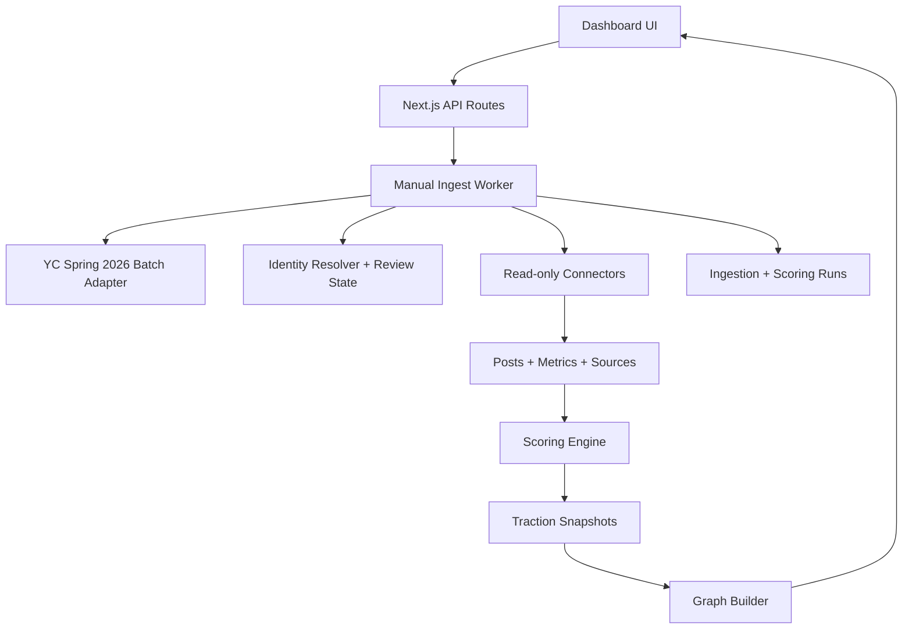

# Architecture

## Overview

YC Network Intelligence is a read-only Next.js dashboard for mapping YC startups, founders, public traction signals, and relationship edges.

Default batch:

- Slug: `S2026`
- Label: `YC Spring 2026`
- Expected company count: `197`

The app must support alternate batches through the batch selector, but all empty/default UI, ingest, and graph requests should begin with `S2026`.

Pipeline:

1. Batch ingestion discovers YC Spring 2026 companies and founders.
2. Identity resolution links company/founder entities to public profiles and assigns a `review_state`.
3. Connectors fetch read-only posts, metrics, and source evidence from safe public or official sources.
4. Scoring normalizes traction signals within platform and within batch.
5. Graph builder creates company-only graph nodes and typed weighted company edges.
6. Dashboard visualizes loaded company count against the expected count, graph structure, evidence, leaderboard, hottest movers, and review queue.

## Tech Stack

- Next.js App Router
- TypeScript
- Supabase/Postgres
- Supabase migrations
- React
- Cytoscape.js via `react-cytoscapejs`
- In-process manual worker for MVP, backed by `ingestion_runs` and `scoring_runs`
- Playwright only for future explicit, read-only browser tasks when necessary and approved
- Vitest for core tests

## Review State

Every extracted or linked entity that needs human validation uses the same state machine:

- `verified`: source-backed and accepted for product display.
- `needs_review`: visible but flagged for review before downstream trust.
- `rejected`: retained for audit/history and excluded from primary scoring and graph emphasis.

The product, database, UI, and APIs should not expose numeric identity-quality percentages. Explanations, source URLs, and review state are the audit surface.

## Graph Library Decision

Chosen library: Cytoscape.js with `react-cytoscapejs`.

Reasons:

- Durable, mature graph/network library.
- Handles weighted node/edge styling, zoom, pan, layouts, hover/click selection, and graph filtering.
- Easier for exploratory node-link networks than React Flow, which is stronger for workflow diagrams.
- More production-ready interaction primitives than hand-rolled D3 for this MVP.
- Supports incremental extension to larger graphs and layout plugins later.

Alternatives considered:

- React Flow: excellent UX for node editors, less natural for dense social/entity network analysis.
- Sigma.js: strong for very large graphs, but more setup friction for rich panel-driven MVP and typed edge styling.
- D3: maximum control but more custom code and interaction risk.

## Modern Graph Encoding

The graph should feel like an analytical map, not a decorative social bubble chart.

- Node type: company only for the rendered graph. Founders remain in the database and panel context, but do not render as graph circles.
- Node size: batch-relative traction percentile, capped so large companies do not dominate the map.
- Node color: group-partner/industry cluster color, with a deliberately varied palette.
- Node shape: circle for every company. Business model is shown in panel metadata, not graph shape.
- Node ring: `verified` solid ring, `needs_review` amber dashed ring, `rejected` red muted ring or hidden by default.
- Node label: company name, placed only when it can fit without colliding with other labels or circles.
- Edge width: relationship weight.
- Edge style: `industry_similarity` subtle thin line and `same_group_partner` subtle dashed cue. `founder_of` edges are not rendered.
- Edge opacity: lower for weaker relationships; increase on selected-node neighborhood.
- Layout: group partner influences clusters/regions when reliable public data exists.
- Batch progress: show loaded companies versus `company_count_expected` near the batch selector.

See `docs/UI_DESIGN_SYSTEM.md` for the visual system contract.

## Worker Approach Decision

Chosen MVP approach: manual API-triggered worker pipeline with job tables.

Implementation:

- `POST /api/ingest/batch` creates an `ingestion_run`.
- The route executes a bounded local pipeline in development/demo mode.
- In production with Supabase configured, the same pipeline writes run status/logs to Postgres.
- No schedule. No autonomous background scraping.

Reasons:

- Matches manual-refresh constraint.
- Works locally without Redis, queues, or extra infrastructure.
- Maps cleanly to future Supabase Edge Functions, Inngest, BullMQ, or scheduled workers later.
- Keeps a durable audit trail through `ingestion_runs`, `scoring_runs`, snapshots, and evidence.

Alternatives considered:

- Inngest: good production ergonomics, but extra service/setup before MVP.
- BullMQ/Redis: robust queueing, but more local infrastructure.
- Cron/scheduled worker: explicitly out of scope for MVP.

## Runtime Modes

### Demo Mode

Works with no credentials and no Supabase connection. Uses local seed data to render:

- YC Spring 2026-like companies
- founders
- social profiles
- evidence posts
- scores
- graph edges
- leaderboard
- hottest movers
- review queue examples

Demo mode must label data as fake and should preserve the default `S2026` batch shape.

### Supabase Mode

Enabled when required environment variables are present. API routes read/write Supabase tables and worker pipeline persists runs, entities, evidence, metrics, scores, and graph edges.

## Data Flow

## Connector Architecture

All connectors implement the shared interface:

- `discoverProfiles(entity)`
- `fetchRecentPosts(profile, options)`
- `fetchMetrics(post)`
- `normalizePost(rawPost)`
- `getPermalink(rawPost)`
- `getAccountMetrics(profile)`
- `explainLimitations()`

Connector implementations must be read-only and return limitation metadata.

Initial connector priority:

1. GitHub
2. Web/search
3. Product Hunt public web/search
4. YouTube
5. RSS/blogs
6. X/Twitter only via official API/config or explicit browser approval
7. LinkedIn only via public/manual/official routes or explicit browser approval
8. Instagram public unauthenticated pages only

## Safety Boundaries

The app must not include write-capable connector methods. UI buttons and API routes are named around ingest, refresh, review, and evidence. There are no external account mutation routes.

Credential files:

- `.env.local` ignored.
- browser profiles ignored.
- cookies/session files ignored.
- app docs only reference placeholders.
