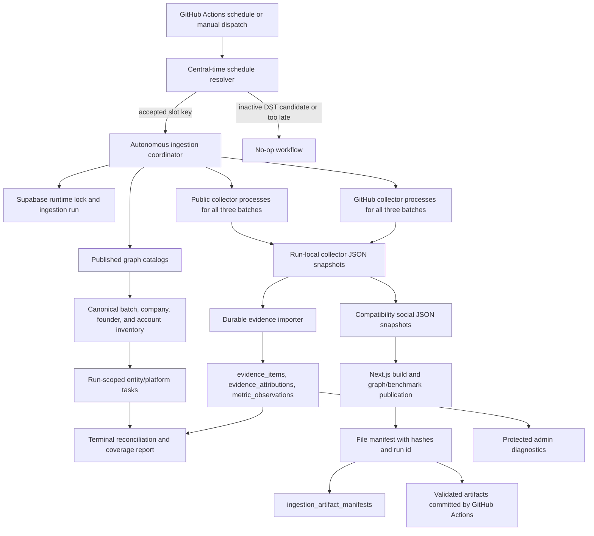

# Autonomous Ingestion Architecture

## Status and scope

This document describes the autonomous ingestion implementation in this repository. It is an implementation description, not evidence that migration `008_autonomous_ingestion_runtime.sql` has been applied to a production database, that the workflow has completed in production, or that optional provider credentials are configured.

The current system has two persistence paths:

- Supabase operational and evidence tables are the intended durable source of truth for runs, tasks, canonical evidence, attributions, metric observations, coverage, and artifact metadata.
- Checked-in JSON remains the active application and publication read path. The graph datasets import the social JSON snapshots, and the workflow commits refreshed JSON and graph artifacts after a successful run.

The system is therefore in a dual-write transition. Durable ingestion exists, but the application has not yet transitioned its graph read path away from JSON.

## System context



## Scheduling and idempotency

The workflow targets two wall-clock slots every day in `America/Chicago`:

| Central slot | During CDT, UTC-5 | During CST, UTC-6 |
| --- | --- | --- |
| `06:17` | `11:17 UTC` | `12:17 UTC` |
| `18:17` | `23:17 UTC` | `00:17 UTC` on the following UTC date |

GitHub Actions cannot express an IANA time zone in cron, so the workflow declares all four UTC candidates:

```text
17 0 * * *
17 11 * * *
17 12 * * *
17 23 * * *
```

`scripts/lib/ingestion-schedule.mjs` converts the candidate occurrence to `America/Chicago` and admits it only when the local time is exactly `06:17:00` or `18:17:00`. The inactive daylight-saving candidate exits without installing dependencies or collecting data. A scheduled candidate can be replayed for up to 11 hours after its nominal occurrence; an even later accepted candidate fails loudly so operators can replay the missing slot. The resolver anchors a delayed candidate to the nearest prior occurrence, which matters for the `23:17 UTC` candidate after midnight UTC.

Accepted scheduled runs receive keys such as `central-2026-07-18-0617`. Manual `workflow_dispatch` runs require an explicit 1-128 character replay key matching `[A-Za-z0-9][A-Za-z0-9._:-]{0,127}`. The key becomes `ingestion_runs.idempotency_key` and is unique when non-null.

GitHub Actions also has a single non-canceling concurrency group named `autonomous-ingestion`. Database locking remains necessary because local invocations and other actors are outside that GitHub concurrency group.

## Coordinator lifecycle

`scripts/run-autonomous-ingestion.mjs` is the current coordinator.

1. Require an idempotency key. A `--plan` run is the only mode that does not require Supabase credentials.
2. Load the three published catalog graphs: `S2026`, `S26`, and `A16ZSR006`.
3. Build one task for every catalog entity and every represented platform.
4. Claim the global `autonomous-ingestion` runtime lock with a 20-minute lease.
5. Read or create the idempotent ingestion run, also with a 20-minute lease.
6. Every 60 seconds, update the run heartbeat and renew the runtime lock.
7. Upsert batches, companies, founders, company-founder joins, and declared social accounts.
8. Upsert the complete run task plan.
9. Start three broad-public collectors and three GitHub collectors in parallel, then await all six with `Promise.allSettled`.
10. Reconcile collector results to queued tasks by exact batch, platform, entity type, and entity ID.
11. Canonicalize and import available snapshots into durable evidence tables.
12. Merge fresh output with the last-good compatibility social JSON snapshots.
13. Persist an overall coverage report and refuse publication if any task is nonterminal.
14. Unless `--skip-publish` is set, build the application, publish graph and benchmark JSON, write and validate the artifact manifest, and record that manifest in Supabase.
15. Publish the exact validated artifact set from inside the coordinator, then atomically finalize the leased run and release the runtime lock. In GitHub Actions, publication includes the commit and push; a push failure prevents durable completion.

If a completed run already exists for the key, the invocation is a no-op. An incomplete run with the same key reacquires its run lease before resuming.

The coordinator preserves last-good public and GitHub rows when a refresh fails or returns no validated replacement. The current process-level retry path performs up to three attempts for transient failures. It still reconciles subprocess snapshots after collection rather than claiming each account task through the database worker RPC, so the durable fine-grained queue remains a substrate for the next worker rollout rather than the active coordinator execution model.

## Inventory and task plan

The platform registry represents these platforms:

`github`, `x`, `linkedin`, `instagram`, `product_hunt`, `youtube`, `rss`, `web`, `reddit`, `hacker_news`, `bilibili`, `tiktok`, and `bluesky`.

The reusable TypeScript inventory model emits an entry for each entity/platform pair with one of four states:

- `ready`: at least one enabled account or derived endpoint is present.
- `missing_account`: the platform applies, but no source endpoint is present.
- `not_applicable`: the platform does not apply to the entity type.
- `disabled`: the registry, caller, or all declared accounts disable collection.

The current coordinator uses its JavaScript planning module rather than `buildAccountInventory`. That planner reads account mappings from published graph nodes and applies additional batch-specific rules:

- Every company and founder is represented on all 13 platforms in the plan.
- Founder collection is queued only for GitHub, X, Instagram, and LinkedIn.
- The broad public collector normalizes the A16Z graph catalog and queues the same company/founder public-platform checks for `A16ZSR006` as for the YC batches.
- Bilibili, TikTok, and Bluesky are terminal as `collector_not_available`.
- GitHub without an account mapping is terminal as `needs_review` with `missing_account_mapping`, except the A16Z collector may perform discovery.

At the catalog state asserted by the current contract tests, the plan contains 1,029 entities and 13,377 entity/platform tasks. Of these, 4,243 are queued and 9,134 are pre-terminal; 1,907 are missing account mappings and 7,227 are explicitly unsupported or not applicable. These numbers will change when the checked-in catalogs change, so `npm run ingest:autonomous:plan` is the authoritative preflight.

## Collector matrix

The matrix below describes the autonomous workflow, not every experimental or manual script in the repository.

| Platform | Autonomous scope | Credential behavior | Actual limitations |
| --- | --- | --- | --- |
| GitHub | Companies and founders in all three batches | Public API works unauthenticated; the workflow supplies `github.token` as `GITHUB_TOKEN` to raise limits | The standalone collector has its own three-attempt handling for rate limits and 5xx responses. Discovery can be ambiguous and remains subject to attribution checks. |
| X | Companies and founders in all three batches | Current autonomous collector uses public pages/search; `X_BEARER_TOKEN` is passed by the workflow but not consumed by the collector | No authenticated X collection is wired into this workflow. Public pages can block, omit metrics, or yield review-only candidates. |
| Instagram | Companies and founders in all three batches | Public attempts only in this workflow | The repository has an opt-in logged-in collector, but the autonomous workflow deliberately never invokes it. Public access can be blocked or incomplete. |
| LinkedIn | Companies and founders in all three batches | No credential is consumed | Public pages/search can be attempted, but login walls and blocked pages must remain failures or review items. |
| YouTube | Company collection in all three batches | Public search metadata only | The planner marks founder YouTube tasks not applicable. Cookie paths are not used by the autonomous workflow. |
| Product Hunt | Company collection in all three batches | Public pages and search only | Search or product pages can block; candidates require company matching. Founder tasks are not applicable. |
| Reddit | Company collection in all three batches | Current path uses public JSON/page access | Reddit client credentials are passed by the workflow but not consumed by the current broad-public script. Network restrictions can block both JSON and page fallback. |
| Hacker News | Company collection in all three batches | Public Algolia/API access | Exact-name matching can produce no verified result. Founder tasks are not applicable. |
| RSS | Company collection in all three batches | Public feeds only | Requires a discoverable public RSS/Atom endpoint. RSS is contextual and does not create native traction observations. |
| Web | Company collection in all three batches | Public pages and search only | Official pages and mentions are contextual, not native traction. Block/login/CAPTCHA pages are failures. |
| Bilibili | None | No autonomous credential path | Manual/static evidence may exist, but no autonomous collector is wired. |
| TikTok | None | No approved access path is wired | Collection is disabled and represented evidence is currently unscored. |
| Bluesky | None | Public AT Protocol reads are not wired | Collection is disabled and represented evidence is currently unscored. |

All automated collection is read-only and limited to publicly accessible or explicitly authorized interfaces. Operators must not add CAPTCHA circumvention, session theft, credential sharing, private endpoint use, robots or access-control bypasses, or browser automation that evades a platform login wall. A blocked or unavailable source is a terminal failure, skip, or review condition, not authorization to bypass the control.

## Task and run states

Run states are `queued`, `running`, `completed`, `failed`, and `canceled`.

Task states are:

| Class | States | Meaning |
| --- | --- | --- |
| Nonterminal | `queued`, `running`, `retry_scheduled` | Work can still be claimed or resumed. |
| Terminal success/review | `completed`, `needs_review`, `blocked_or_empty`, `skipped` | No more automated work is expected for this run. These do not all mean evidence was collected. |
| Terminal failure | `failed`, `canceled`, `dead_lettered` | Work ended unsuccessfully or was abandoned. |

The current coordinator normally uses `queued`, pre-terminal `needs_review`/`skipped`, and reconciled `completed`/`failed`. It does not claim individual tasks through `claim_ingestion_tasks`, transition them to `running`, reschedule them as `retry_scheduled`, or dead-letter collector failures. Those capabilities exist for a future fine-grained worker but are not the current execution path.

## Leases, retries, dead letters, and circuits

### Runtime and task leases

Migration 008 defines a singleton-style runtime lock table with token-protected claim, renewal, and release functions. A lock can be replaced only after expiry or by the same owner. The coordinator uses a 20-minute lease and a 60-second heartbeat.

Task workers can atomically claim up to 100 due tasks with `FOR UPDATE SKIP LOCKED`. Claims increment `attempts`, set a worker and random lease token, and default to a five-minute lease. Transitions in `AutonomousIngestionStore` require the current worker, token, `running` status, and an unexpired lease.

### Task retry and DLQ substrate

`requeue_expired_ingestion_tasks` processes up to 1,000 expired leases. It uses exponential delay:

```text
min(3600 seconds, retry_base_delay_seconds * 2^(attempts - 1))
```

The exponent is capped at 10. A task at `max_attempts` becomes `dead_lettered` with reason `lease_expired_after_max_attempts`, and an `open` row is upserted in `ingestion_dead_letters`. Otherwise it becomes `retry_scheduled`.

The coordinator sets `max_attempts` to 3 on its planned tasks, but because it does not use task claims or the requeue function, this retry/DLQ path does not currently govern its child collector processes. Collector process timeouts are 55 minutes for broad-public runs and 45 minutes for GitHub runs. A process-level collector failure is recorded directly as terminal `failed` on matching tasks.

### HTTP policy substrate

`scripts/lib/http-policy.mjs` provides:

- global and per-provider concurrency admission;
- global and provider pacing;
- per-attempt and total request deadlines;
- up to three attempts by default;
- retry of network errors and HTTP `408`, `425`, `429`, and `5xx`;
- full-jitter exponential backoff, honoring `Retry-After` and GitHub reset headers;
- an in-memory per-provider circuit breaker that opens after five failed requests for 30 seconds by default and permits one half-open probe.

The autonomous collector scripts do not currently import this module. Its circuit state is process-local, is not persisted to `provider_rate_limits`, and resets on process restart. The `provider_rate_limits` table and the policy-related environment variables in `.env.example` are therefore schema/configuration groundwork, not active coordinator guarantees.

## Durable evidence import

The importer accepts broad-public and GitHub snapshot shapes, then:

1. Normalizes platform aliases and canonicalizes URLs.
2. Rejects invalid native IDs, native ID conflicts, invalid metrics, unsupported traction sources, and native objects with no positive visible metrics from scoring eligibility.
3. Retains canonicalizable context and rejected rows in `evidence_items` with reasons in metadata.
4. Deduplicates evidence by `(platform, canonical_key)` and reads IDs back after upsert.
5. Writes deterministic verified attributions when an entity resolves to the synchronized catalog.
6. Appends unique metric observations keyed by evidence, metric, source, and observation time.

Only verified attribution rows are persisted. Only traction-eligible native objects produce metric observations. Derived metrics such as `score`, `profile_score`, `contribution_score`, and `max_repo_score` are excluded from raw metric normalization.

Migration 008 makes `metric_observations` and `ingestion_run_events` append-only by rejecting updates and deletes. Service-role writes are required; anonymous and authenticated roles receive no access to operational tables.

## Coverage semantics

The coordinator stores one `overall` coverage report for the run. Its counters are:

- `expected`: total persisted tasks for the run.
- `attempted`: tasks whose state is not `queued`. This includes pre-terminal skips/review tasks and does not exclude `running` or `retry_scheduled`.
- `succeeded`: tasks in `completed`.
- `failed`: tasks in `failed` or `dead_lettered`.
- `skipped`: tasks in `skipped`, `needs_review`, or `blocked_or_empty`.
- `nonTerminal`: tasks outside the seven terminal states.
- `coveragePercentage`: `(expected - nonTerminal) / expected * 100`, or 100 for an empty plan.
- `stageCounters`: durable importer counts for received, rejected, duplicates, stored/read-back evidence, attribution outcomes, metric observations, and unstorable rejection details.

Coverage percentage measures terminality, not collection success, freshness, source correctness, or scoring eligibility. A run with failed and skipped tasks can have 100% coverage and can publish because the publication gate checks only `nonTerminal === 0`.

## Artifact publication and manifest

A publishing run performs a production build, runs `benchmarks:daily`, writes `public/graph/manifest.json`, validates the manifest and public artifacts, and records one database manifest row.

Manifest schema version 1 contains:

- `ingestionRunId` and `publishedAt`;
- optional evidence and platform-refresh watermarks derived from graph artifacts or explicit inputs;
- model IDs and versions found in graph and benchmark artifacts;
- every graph and benchmark JSON filename, SHA-256, byte size, generation timestamp, and optional model version;
- an overall SHA-256 over the graph and benchmark entry lists.

The database row uses artifact key `public-graph-manifest`, type `graph_manifest`, and URI `repo://public/graph/manifest.json`, with the complete file manifest in `metadata_json`. `INGESTION_ARTIFACT_BUCKET` is currently unused; no object-storage upload occurs.

The workflow performs another `artifacts:validate` after the runner, stages only the allowlisted public graph, benchmark, and social JSON paths, then commits and pushes if there are changes.

## Admin diagnostics and security

The UI is `/admin/ingestion`; the API is `GET /api/admin/ingestion`.

Outside a development loopback request, the API fails closed unless at least one of `ADMIN_INGESTION_SECRET` or `REFRESH_SECRET` is configured. It accepts a bearer token or `x-admin-ingestion-secret`, compares SHA-256 digests with constant-time equality, and always sends no-store headers. The browser page keeps the supplied secret in component memory and sends it as a bearer token.

Supported views are `summary`, `runs`, `tasks`, `failures`, and `artifacts`, with bounded pagination and restricted status/platform/run filters. Supabase diagnostics require both `NEXT_PUBLIC_SUPABASE_URL` and `SUPABASE_SERVICE_ROLE_KEY`. Development can fall back to metadata for four fixed filesystem artifact paths; it does not parse arbitrary files.

Current diagnostic limitations are material:

- `failures` reads the legacy `source_failures` table, not `ingestion_dead_letters`.
- `artifacts` reads `evidence_items`, not `ingestion_artifact_manifests`.
- Summary pending tasks count only `queued` and `running`, not `retry_scheduled`.
- The UI does not expose run events, heartbeats, runtime locks, coverage reports, checkpoints, provider rate-limit state, or dead-letter resolution.
- The current coordinator does not write collector failures to `source_failures`, so the Failures view can omit failures visible on tasks and run events.

Operators must use direct service-role SQL or Supabase administration for those tables until dedicated protected views are implemented.

## Dual-write transition away from JSON

### Current authority boundaries

| Concern | Current authoritative path |
| --- | --- |
| Run coordination and audit | Supabase runtime tables |
| Canonical imported evidence and raw metric history | Supabase durable evidence tables |
| Graph build inputs and application dataset | Checked-in social JSON plus catalog JSON |
| Published graph and benchmark snapshots | Checked-in JSON artifacts |
| Artifact integrity | File manifest plus one Supabase manifest record |

The durable importer does not yet feed the graph builder. Deleting or stopping JSON writes now would remove data from the active application read path.

### Required transition gates

1. Add a repeatable, resumable backfill from every compatibility JSON source into durable evidence tables. Record a run ID, input hashes, received/stored/rejected counters, and unresolved attribution counts.
2. Build database read models that reproduce the graph dataset contract, including catalog ownership, canonical evidence selection, metric observation as-of rules, review state, and batch scoping.
3. Run JSON and database readers in shadow mode against the same run. Compare canonical evidence keys, attribution targets, metric values/timestamps, score inputs, node scores, rankings, and platform coverage.
4. Define explicit parity tolerances and block the read switch while unexplained differences, unresolved attributions, or manifest mismatches remain.
5. Make the database reader authoritative behind a reversible deployment control while continuing JSON export as a compatibility output.
6. After downstream consumers and rollback procedures use the database path, stop treating social JSON as source input. Public graph JSON may remain a deployment artifact, but it should be generated from a durable run rather than imported back into the application as primary evidence.
7. Remove compatibility writes only after at least one full retention window of successful twice-daily runs, replay validation, and a tested rollback to the database-backed prior run.

No checked-in feature flag, database graph reader, selective backfill CLI, or automated parity report currently completes these gates. They are required future work, not deployed behavior.
