# Scoring v4 Final Methodology Report

> Historical baseline: this report records the immutable `4.0.0` methodology.
> Production `4.3.1` uses a reference-anchored monotonic transform, removes
> publication-age and recent-commit scoring, uses two `95/5` evidence slots,
> gives the strongest platform `95%` of the entity aggregate, bounds fixed-share
> cross-platform corroboration to `5%`, applies a 95% level calibration, and
> maps the global best to a 95-point headline target. See
> [`SCORING_MODEL.md`](SCORING_MODEL.md) for the current contract.

## 1. Decision and evidence boundary

The methodology audited in this historical report is `returner-traction`
version `4.0.0`, named `returner-traction-v4-canonical`. It remains the
immutable rollback target. The current configuration and scorer are
[`src/lib/scoring/traction-config.ts`](../src/lib/scoring/traction-config.ts)
and [`src/lib/graph/traction-scoring.ts`](../src/lib/graph/traction-scoring.ts).

The decision is to retain the implemented v4 combination:

- `85%` platform-anchored absolute evidence score plus `15%` same-platform midrank.
- `75%` durable signal plus `25%` recency-sensitive momentum.
- Descending platform evidence slots of `82/8/5/3/2` over at most five physical posts.
- `100%` normalized configured-weight aggregation over platforms with eligible evidence; missing platforms do not penalize the company.
- For full-batch company records only, `82%` absolute company score plus `18%` positive-cohort tie-aware percentile, followed by a positive-cohort 1–100 stretch.
- Confidence, limitations, attribution state, canonical score provenance, and evidence time reported separately from the traction score.

This is an engineering selection, not an outcome model. No labeled outcome, investment return, survival, revenue, fundraising, or follow-on dataset is present. Consequently this report does **not** claim predictive validation, statistical calibration to an outcome, causal validity, optimal weights, or investment performance. A `72` is a deterministic traction index, not a `72%` probability.

This report also does **not** claim that:

- any external source is reachable now;
- the diagnostic or experiment runners made live network calls;
- migrations were applied to a database;
- legacy data was backfilled;
- a v4 model-version row or scoring run was persisted;
- TikTok or Bluesky accounts/evidence were collected;
- any account was added by this methodology work.

Where sources disagree, this report uses this precedence order:

1. Current executable code and tests.
2. Generated artifacts whose recorded source hashes match the current files.
3. Narrative audits and model documentation.
4. Older coverage and operational status snapshots, always with their dates preserved.

## 2. Evidence base and freshness

| Evidence | Role | Current interpretation |
| --- | --- | --- |
| [`SCORING_V4_SOURCE_AND_PIPELINE_AUDIT.md`](SCORING_V4_SOURCE_AND_PIPELINE_AUDIT.md) | Point-in-time source, persistence, publication, cache, and UI audit | Source-of-truth companion for pipeline structure and source inventory. It performed local in-memory/API reads but no remote source request, source refresh POST, database connection, migration, backfill, account addition, or publisher run. Its recorded test/build/API observations remain historical; Section 13 lists the narrower current component evidence and pending final gates. |
| [`SCORING_MODEL.md`](SCORING_MODEL.md) | Detailed formula narrative | Current description of the canonical v4 formula, all-platform company score, visibility filters, provenance, and known limitations. |
| [`SCORING_V4_AUDIT.md`](SCORING_V4_AUDIT.md) | Code-conformance and v3 retirement audit | Accurate for the reviewed core, but point-in-time for generated-artifact freshness and later compatibility/source/persistence additions. |
| [`SCORING_EXPERIMENTS.md`](SCORING_EXPERIMENTS.md) | Checked-in candidate summary | Generated from the current checked-in experiment artifact at its frozen clock; descriptive engineering evidence on local unlabeled snapshots. |
| [`outputs/scoring-diagnostics-v4-report.md`](outputs/scoring-diagnostics-v4-report.md) | Checked-in human-readable diagnostics | Current rendering of the checked-in audit; SHA-256 `e70062c98ddf19db6723e29098016819646a0999679b7b5fa4ba1259e8b35114`. |
| [`outputs/scoring-diagnostics-v4-audit.json`](outputs/scoring-diagnostics-v4-audit.json) | Full diagnostic evidence | SHA-256 `15ebc273d209022a7fb9a59829dbaa197ef11b1cebed440bf590c0c23b4b9177`. Frozen clock `2026-07-17T12:00:00.000Z`. |
| [`outputs/scoring-experiments-v4.md`](outputs/scoring-experiments-v4.md) | Checked-in human-readable candidate comparison | Current rendering of the checked-in experiment; SHA-256 `5758bc9eacbb2ea2d2d79f22b2ad7eb9d55a1f10c1c61c9fee0c1a0051d105d8`. |
| [`outputs/scoring-experiments-v4.json`](outputs/scoring-experiments-v4.json) | Full candidate and company evidence | SHA-256 `16bd3e64027c962af3650252a94032de5beb9ab7fe4640e488b9051772e11ff4`. Frozen clock `2026-07-16T12:00:00.000Z`. |
| [`EVIDENCE_ATTRIBUTION_AUDIT.md`](EVIDENCE_ATTRIBUTION_AUDIT.md) | Attribution review snapshot | Older point-in-time audit, generated `2026-06-29`; useful for known attribution risks, not proof of current counts. |
| [`COVERAGE_REPORT.md`](COVERAGE_REPORT.md) | Source coverage snapshot | Point-in-time S2026 source inventory generated `2026-07-16T00:24:31.860Z`; source-access statements are historical observations, not live checks made for this report. |

The diagnostic artifact deliberately stores `git_sha: null` so committing a regenerated artifact does not immediately invalidate byte reproduction; its complete input and source manifests bind the frozen run instead. The older experiment artifact records Git `4c902faca02f971a3008cd9f76e1a94d5b14d854`. Their embedded manifests and artifact hashes identify their respective runs. The final local release checks below were run after implementation stopped changing; they do not prove deployment or external-source liveness.

| File | SHA-256 recorded and rechecked |
| --- | --- |
| `src/lib/scoring/traction-config.ts` | `46d6faa700c3e976316c234040f50247270d7a63f8e5c5fe680dd12d1e08496a` |
| `src/lib/graph/traction-scoring.ts` | `13ce112870b2604d0b49209dc34a43e2becf9110ca5d4d18872562fba9258894` |
| `src/lib/graph/dedupe.ts` | `19f05e277f8477b73c215d5156ffda3fdbfa5039b7557921afb0f67cf8389c82` |
| `src/lib/scoring/batch-calibration.ts` | `6b8395f2dc3e9d41ff1b3cf67939fa594d20e5359b74d2249bb1418c5b4de9d6` |
| `src/lib/scoring/percentiles.ts` | `2eede1f254f4b6b18a872fc956b1efefd6c0a38370f67322c5766f54c1488607` |
| `src/lib/graph/yc-spring-2026-dataset.ts` | `2324200947bb159c38455897fe8ee670385d4fb85bfb598b29635f3bacd4c740` |
| `src/lib/graph/a16z-speedrun-006-dataset.ts` | `fc0d83cac1706b76cc191b1dcd4771c0c03b31b20454021ac9426ab32861eb85` |
| `src/lib/graph/evidence-attribution.ts` | `fd175c397cf1dd0ece4ef2439d7f7240b435a4c03f33bc226c4c41735cb05e82` |
| `src/lib/graph/graph-builder.ts` | `3e9bd1e0a99a3bc554b37cd462de1a794d7d0cf4f2729133bdd53cc36607d208` |
| `src/lib/graph/client-filters.ts` | `5546b654b7f886b8aa99a331deeafe6a0270c87e16468aeb15e395a35dde082e` |
| `src/lib/graph/live-evidence-overlay.ts` | `37d649382184f2951fd103cc13a232efa7ae771118ab887ec14316771981128b` |
| `src/lib/graph/static-graph-snapshot-contract.mjs` | `b10177cb8116b015f346f7ab1c0af8f159ea2f7086a87bfe844f4ca73f8901d6` |

The current diagnostic records input-envelope SHA-256 `0c2595d3c061037ffe6480cfbe624f5bfb2aa1de5a70e3e5c11d294dddd66ac5`, 83 canonical parameters, eight role-labeled runtime source files, and combined versioned-scoring-input SHA-256 `3bc4182861dfb6a08ff4c219a197ecffcc0a1431715d43c2a75e1713ad3f933d`. It reports `13/13` invariants passing before artifact writes. The experiment records production-config hash `adfce3cd311a6fd658f76406679e2ad536ef56163b3cc18da879afc19645cf28`, dataset hash `dee12b50325b8a494d2b457bb5f2c01b69b30957eac238e6f09b992805abe474`, no config mutation, and six source hashes. These are frozen local byte-provenance facts only; they do not prove deployment, database persistence, browser behavior, or external-source liveness.

## 3. Actual architecture

```mermaid
flowchart LR
  A["Local YC/a16z and social snapshots"] --> B["Cohort dataset builders"]
  B --> C["Attribution guard"]
  C --> D["Entity-scoped canonical dedupe"]
  D --> E["Eligibility and metric alias normalization"]
  E --> F["Physical-post percentile sample"]
  F --> G["Evidence score and recency"]
  G --> H["Physical dedupe and platform slots"]
  H --> I["Absolute company/founder score"]
  I --> J["Positive-company batch calibration"]
  J --> K["Canonical all-platform company score"]
  K --> L["Graph builder, visibility filters, and process cache"]
  L --> M["Dashboard and client filters"]
  L --> N["Daily benchmark/static publisher"]
  N --> O["Nine static graph files and benchmark history"]
  O --> M
  P["Manual X live refresh"] --> Q["Validated local targeted snapshot"]
  Q --> R["Live overlay merge and rescore"]
  R --> K
  S["Migrations 004-007: lineage and model registration"] -.-> T["Unimplemented end-to-end database evidence/run writer"]
  T -.-> K
```



### 3.1 Runtime ownership map

| Stage | Canonical owner | Important behavior |
| --- | --- | --- |
| Source snapshots and cohort assembly | [`yc-spring-2026-dataset.ts`](../src/lib/graph/yc-spring-2026-dataset.ts), [`a16z-speedrun-006-dataset.ts`](../src/lib/graph/a16z-speedrun-006-dataset.ts) | Builds S2026, S26, and A16ZSR006 from local snapshots; applies attribution, dedupe, normalization, rollup, and company calibration. |
| Attribution | [`evidence-attribution.ts`](../src/lib/graph/evidence-attribution.ts) | Resolves company/founder ownership and can zero or review-gate weak, conflicting, repost, profile, or off-topic evidence. |
| Canonical identity and dedupe | [`dedupe.ts`](../src/lib/graph/dedupe.ts) | Strict native object identity, canonical URL/fallback identity, deterministic replacement, physical-post dedupe. |
| Config and metric aliases | [`traction-config.ts`](../src/lib/scoring/traction-config.ts) | Single canonical model identity and all score, calibration, and confidence parameters. |
| Config validation | [`traction-config.ts`](../src/lib/scoring/traction-config.ts), [`traction-config-validation.test.ts`](../tests/traction-config-validation.test.ts) | Import-time rejection of non-finite/negative weights, unnormalized blends/slots, missing scored-platform references/metrics, nonmonotone slots, and invalid confidence thresholds. |
| Evidence/entity scoring | [`traction-scoring.ts`](../src/lib/graph/traction-scoring.ts) | Eligibility, absolute/midrank blend, recency, platform slots, cross-platform blend, confidence, limitations. |
| Company calibration | [`batch-calibration.ts`](../src/lib/scoring/batch-calibration.ts), [`percentiles.ts`](../src/lib/scoring/percentiles.ts) | Positive-company tie-aware percentile blend followed by a 1–100 positive-cohort stretch. Founder scores are not calibrated here. |
| Graph filtering | [`graph-builder.ts`](../src/lib/graph/graph-builder.ts), [`client-filters.ts`](../src/lib/graph/client-filters.ts) | Preserves one canonical all-platform company score while platform and Top Voice controls narrow visible companies, evidence, and related metadata. |
| Material live changes | [`live-evidence-overlay.ts`](../src/lib/graph/live-evidence-overlay.ts) | Merges visible evidence, renormalizes, reaggregates, and recalibrates visible companies. |
| Manual source refresh | [`live-source-refresh.ts`](../src/lib/ingestion/live-source-refresh.ts) | The implemented live path is X-specific and writes a validated local snapshot; other listed platforms are skipped. |
| Legacy demo-domain path | [`formulas.ts`](../src/lib/scoring/formulas.ts), [`aggregation.ts`](../src/lib/scoring/aggregation.ts), [`model.ts`](../src/lib/scoring/model.ts), [`build.ts`](../src/lib/graph/build.ts) | Retains older follower-rate, average, and re-normalized-weight behavior for the separate demo path. It is not the canonical v4 graph-response scorer. |
| Durable lineage | [`004_traction_scoring_evidence_lineage.sql`](../supabase/migrations/004_traction_scoring_evidence_lineage.sql) | Defines canonical evidence, attribution, observations, model versions, versioned runs, and run-scoped snapshots. No application backfill/writer is demonstrated. |
| Model registration | [`007_register_traction_scoring_v4.sql`](../supabase/migrations/007_register_traction_scoring_v4.sql) | Declares an idempotent exact-config v4 insert and drift check plus a run-history index. Presence in the tree is not proof it was applied. |
| Static publication | [`update-daily-benchmarks.mjs`](../scripts/update-daily-benchmarks.mjs), [`static-graph-snapshot-contract.mjs`](../src/lib/graph/static-graph-snapshot-contract.mjs), [`public/graph/`](../public/graph/) | Publisher validates all nine graph variants; every canonical snapshot uses `scoreScope="all_platforms"` and `selectedPlatforms=[]`, including Top Voice variants. This is a local artifact contract, not a deployment claim. |

### 3.2 Actual source/pipeline boundary

The primary graph is currently assembled from repository snapshots at module load, not from an end-to-end database scoring worker. [`src/lib/workers/ingest-batch.ts`](../src/lib/workers/ingest-batch.ts) explicitly fails closed in database mode because YC, connector persistence, and scoring persistence are not fully wired. Its successful path is deterministic demo assembly.

The connector registry describes capabilities, but it is not itself proof that the production dataset builder fetched those sources. Several registry classes are no-op or identity-only while separate scripts produced historical snapshots. The manual refresh path has an implemented X branch; GitHub, LinkedIn, Instagram, Product Hunt, YouTube, RSS, web, Reddit, Hacker News, and Bilibili are logged as `adapter_not_wired` in that real-time route. TikTok and Bluesky have explicit connector/platform stubs and are represented in runtime/database types, but no collection or scoring model.

The graph builder always emits canonical `scoringContext` values of `scoreScope="all_platforms"` and `selectedPlatforms=[]`. Server and client platform filters preserve that context object and all canonical score surfaces. Top Voice assembly preserves the same company score, source rank, radius, momentum, platform scores, and score breakdown while narrowing matched evidence and adding connection metadata. The static snapshot validator enforces the same context for all nine local variants. These implementation and artifact-contract facts do not establish that a deployment is current or that any external source is reachable.

### 3.3 Source inventory and present coverage

These are checked-in or locally built facts, not current remote-access claims:

| Snapshot | Recorded state | Actual role |
| --- | --- | --- |
| `public-evidence-current.json` | 1,021 rows; recorded `2026-07-09T17:31:59.583Z`; 140 positive upstream flags | Broad collector snapshot hard-wired to S26 input despite a merged checkpoint spanning more slugs. |
| `logged-in-evidence-current.json` | 2,546 rows; 2,524 verified; 2,485 positive flags; recorded `2026-07-09T17:58:46.209Z` | Opt-in OpenCLI snapshot. Its existence does not prove a session remains valid. |
| `targeted-evidence-current.json` | 468 verified positive rows plus one review candidate; latest fetched time `2026-07-16T19:17:20.770Z` | Manual/source-hunt rows and accepted live-refresh X rows. A newer fetched time can coexist with older cleanup metadata. |
| `a16z-speedrun-006-social-evidence.json` | 251 verified seed rows; cleanup metadata `2026-07-16T02:18:38.478Z` | Static/manual A16Z evidence plus downstream validation. |

Current cohort assembly produces this scored-evidence coverage:

| Cohort | Scored / all rows | Modeled scored rows by platform | Important gaps |
| --- | ---: | --- | --- |
| S2026 | 1,976 / 3,273 | X 1,624; LinkedIn 101; GitHub 92; YouTube 76; Instagram 62; HN 18; Product Hunt 2; Reddit 1 | Only 3 companies score on Instagram; 16 companies have no materialized account on any platform. |
| S26 | 362 / 548 | X 221; LinkedIn 66; GitHub 55; YouTube 16; HN 3; Product Hunt 1 | No Instagram or Reddit evidence; 4 companies have no materialized account. |
| A16ZSR006 | 245 / 253 | Instagram 68; LinkedIn 63; YouTube 50; X 38; GitHub 13; Reddit 10; Product Hunt 3 | No HN/Bilibili/TikTok/Bluesky evidence; 4 companies have no materialized account. |

Current graph assembly materializes 957 account rows for S2026 (`953 verified`, `4 rejected` after generic-profile hardening), 402 verified rows for S26, and 328 verified rows for A16ZSR006. A stored review state is not proof of current liveness. The discovery inventory has 1,243 attempts but only 36 success, 10 partial success, and 23 needs-review outcomes; the 89 separate source-discovery paths are candidates, not added accounts. The source audit made no remote request and added none.

## 4. Inherited v3 baseline and failures

The committed baseline at the start of this work was `social-traction-v3-balanced-recency`. It is historical here: the current working-tree scorer is v4.

### 4.1 V3 weights

| Platform | Platform weight | Raw engagement weights | Half-life days |
| --- | ---: | --- | ---: |
| X | 0.34 | `views*0.08 + likes*1.5 + replies*5.5 + comments*5.5 + reposts*8 + shares*8 + quotes*8` | 45 |
| Instagram | 0.22 | `views*0.075 + likes*1.1 + comments*5 + shares*5 + reposts*5 + saves*5` | 45 |
| GitHub | 0.14 | `stars*1.5 + forks*4 + watchers*2 + issues*0.5 + open_issues*0.5 + recent_commits_30d` | 180 |
| LinkedIn | 0.14 | `views*0.08 + likes*1.5 + reactions*1.5 + comments*5.5 + reposts*8 + shares*8` | 60 |
| Product Hunt | 0.07 | `upvotes*2 + comments*3` | 90 |
| YouTube | 0.05 | `views*0.035 + likes + comments*3` | 120 |
| Hacker News | 0.04 | `upvotes*2 + comments*3` | 45 |
| Reddit | 0.03 | `upvotes*2 + comments*3` | 45 |
| Bilibili | 0.02 | `views*0.035 + likes + comments*3 + shares*4` | 120 |

The declared platform weights summed to `1.05`, although v3 re-normalized over present platforms before applying them.

### 4.2 V3 formula

For raw engagement `R`, age `a`, and platform half-life `L`:

```text
decay = 2 ^ (-a / L)
recency_modifier = 0.60 + 0.40 * decay
adjusted_engagement = R * recency_modifier
```

An unavailable publication date used an internal decay value of `0.75`, yielding a `0.90` modifier. V3 then used within-platform cohort extrema:

```text
x = log1p(adjusted_engagement)
N = 5 + 95 * (x - min_platform_x) / (max_platform_x - min_platform_x)
```

All tied values received `50`. Platform aggregation varied by platform family:

```text
GitHub:
P = round(0.78 * max + 0.17 * mean(top 3) + 0.05 * repo_depth)
repo_depth = min(100, log1p(row_count) / log1p(20) * 100)

X/Instagram/LinkedIn/YouTube/Bilibili:
P = round(0.60 * max + 0.35 * mean(top 3) + 0.05 * consistency)

Product Hunt/Hacker News/Reddit:
P = round(0.70 * mean(top 5) + 0.20 * mean(all) + 0.10 * consistency)

consistency = min(100, row_count / 5 * 100)
```

The entity score re-normalized platform weights over available platforms:

```text
weighted_available = sum(P_p * w_p) / sum(w_p for present platforms)
coverage = 0.85 + 0.15 * sqrt(present_platform_count / 9)
v3_total = round(weighted_available * coverage)
```

### 4.3 Why v3 was rejected

1. One new cohort extreme could rescale every other same-platform row without any change to their evidence.
2. Every platform winner was pushed toward `100` even if its absolute traction was weak.
3. Synonymous counters could be added twice: X replies/comments and reposts/shares, LinkedIn likes/reactions and reposts/shares, Instagram shares/reposts, GitHub issues/open issues and often stars/watchers.
4. If a platform-specific weighted sum was zero, the old scorer retried the row using X weights, giving metrics unintended meanings.
5. Eligibility did not require a native post/repository/launch URL, configured visible metrics, acceptable review state, acceptable link state, or URL/ID agreement.
6. Average and consistency terms allowed a weak new row to lower a platform score.
7. Re-normalizing over present platforms mostly erased missing-platform information, while the small `0.85..1.00` coverage factor could not express real source concentration.
8. The score did not identify a model version, absolute-versus-calibrated semantics, evidence cutoff, confidence, or durable input lineage.
9. The platform weights did not sum to one and their effective meaning changed with source availability.

These are determinism, interpretability, and data-contract failures. They do not prove that v4 predicts outcomes better.

## 5. Final input and source policy

### 5.1 Scored platforms and weights

| Platform | Metric formula after alias collapse | Absolute reference `H_p` | Half-life `L_p` | Diversification weight `w_p` |
| --- | --- | ---: | ---: | ---: |
| X | `views*0.04 + likes*1.4 + replies*4.5 + reposts*6 + quotes*6` | 120,000 | 45 | 0.21 |
| Instagram | `views*0.04 + likes*1.1 + comments*4.5 + shares*5 + saves*4` | 80,000 | 60 | 0.21 |
| LinkedIn | `views*0.04 + reactions*1.4 + comments*4.5 + reposts*6` | 18,000 | 75 | 0.15 |
| GitHub | `stars*1.5 + forks*4 + issues*0.5 + recent_commits_30d` | 40,000 | 365 | 0.15 |
| YouTube | `views*0.025 + likes + comments*3.5` | 35,000 | 150 | 0.10 |
| Product Hunt | `upvotes*2 + comments*3.5` | 4,000 | 120 | 0.07 |
| Hacker News | `upvotes*2 + comments*3.5` | 2,500 | 60 | 0.05 |
| Reddit | `upvotes*2 + comments*3.5` | 4,000 | 60 | 0.04 |
| Bilibili | `views*0.025 + likes + comments*3.5 + shares*4` | 35,000 | 150 | 0.02 |

The nine diversification weights sum to exactly `1`. Followers, subscribers, GitHub watchers, and unconfigured metrics do not score. Follower-adjusted engagement rate is not part of v4.

### 5.2 Metric canonicalization

- Non-finite, zero, and negative metrics are removed before weighting.
- X: `replies=max(replies, comments)` and `reposts=max(reposts, shares)`.
- LinkedIn: `reactions=max(reactions, likes)`, `comments=max(comments, replies)`, and `reposts=max(reposts, shares)`.
- Instagram: `comments=max(comments, replies)` and `shares=max(shares, reposts)`.
- GitHub: `issues=max(issues, open_issues)`; `watchers` equal to `stars` is discarded, and watchers have zero configured weight in any event.
- Unknown metric names pass through normalization but receive weight zero.

### 5.3 Evidence eligibility, in evaluation order

A row scores only if all conditions pass:

1. Its platform has a positive canonical platform weight.
2. Runtime `review_state` is exactly `verified`; a missing value fails scoring eligibility.
3. `linkStatus` is not `invalid` or `blocked`.
4. Incoming `contributionScore` is finite and positive. Its magnitude is only an upstream on/off flag at this stage.
5. `sourceUrl` parses as an exact platform-native object.
6. A present non-empty `platformPostId` agrees with the URL-derived identity.
7. At least one positive configured metric remains and weighted raw engagement is positive.

The first failure is recorded. Missing or `unchecked` link status may still score, but a missing review state may not. The persistence contract is stricter still: a persisted `score_eligible=true` attribution also requires `risk_level='low'`.

### 5.4 Native identity grammar

| Platform | Accepted native object shape |
| --- | --- |
| X | Exact X/Twitter status path with numeric ID, including optional native photo/video suffix. Profiles and search pages fail. |
| Instagram | Exact `/p/<id>`, `/reel/<id>`, or `/tv/<id>`. Profiles and search pages fail. |
| LinkedIn | Exact feed activity URN or one `/posts/<segment>` containing an activity ID. Company/profile/search pages fail. |
| GitHub | Exactly `github.com/<owner>/<repository>`, with grammar and reserved-owner checks. User/org profiles and issue subpaths fail. |
| YouTube | Exact watch ID, `youtu.be` ID, Short, or live ID. Channel and search pages fail. |
| Product Hunt | Exact post, forum post, or product launch path. Product overview/search pages without a launch identity fail. |
| Hacker News | Exact `news.ycombinator.com/item?id=<numeric>`. Front pages and nonnumeric IDs fail. |
| Reddit | Exact Reddit comments post or `redd.it` post ID. Profiles and search pages fail. |
| Bilibili | Exact `/video/<id>`. Profile and search pages fail. |
| TikTok | Exact `/<handle>/video/<numeric-id>` on `tiktok.com` or `m.tiktok.com`. Profiles and redirect-only short links fail. |
| Bluesky | Exact `bsky.app/profile/<actor>/post/<record-key>`. Profiles fail. |

TikTok and Bluesky native identities are forward-compatible storage/display support only. They have no weights, references, or collection adapters. An explicitly `verified`, native, identity-consistent row is retained with `tractionStatus="unscored"`, `normalizedScore` absent, and a limitation explaining that no calibrated model exists. It is not a scored zero and does not enter score maps.

Web and RSS remain context-only and contribution zero. Unlike TikTok/Bluesky, they are not represented as native unscored traction platforms by the current scorer.

### 5.5 Source improvements adopted and candidates rejected

| Decision | Final treatment | Reason |
| --- | --- | --- |
| Canonical config validation | Adopted | Invalid normalized totals, scored-platform references/metrics, slot ordering, finite weights, and confidence thresholds now fail at import/test time. This guards configuration shape, not empirical validity. |
| Strict native post identity | Adopted | Prevents profiles, searches, generic pages, lookalike hosts, and fragments from masquerading as scored objects. |
| Review/link/identity/metric eligibility | Adopted | Makes exclusion deterministic and explainable. |
| Alias maximum rather than sum | Adopted | Prevents duplicated visible counters from inflating raw engagement. |
| Company/founder attribution guard | Adopted | Requires verified account, target identity/domain/body evidence, or another accepted target signal; conflicts and off-topic evidence can be held. |
| Native-proof attribution hardening | Adopted | Generated title/author-name/reason fields and social-link domains are not proof. Actual native body/card text and verified author/account handles carry the target signal; title-copy text is excluded. |
| A16Z author ownership separate from mentioned target | Adopted | A verified account or exact founder author owns founder evidence; a mentioned founder is retained separately as `targetFounderId`. Unresolved author ownership falls back to the company. |
| Verified-only live X target accounts | Adopted | Manual live refresh selects only accounts whose review state is exactly `verified`, and overlay replacement preserves the winning row's contribution flag. |
| LinkedIn comments separated from parent posts | Adopted | Stable native comment IDs are retained as context-only attention; unlocated comments are held and parent-post rows falsely presented as comments are rejected. Parent-post IDs and metrics never become comment/company traction. |
| Generic or malformed social profile identities | Rejected | Account URLs must yield a non-generic platform identity. Feed, search, login, activity, and other generic path tokens cannot create a verified account handle. |
| Physical-post dedupe across company/founder rows | Adopted | One native object contributes once to one rollup even if multiple source/attribution rows exist. |
| Web/RSS as traction | Rejected | They provide context but lack comparable native response metrics in the canonical model. |
| Profiles/search pages as evidence | Rejected | They are identity/discovery context, not discrete traction events. |
| Follower count and engagement rate | Rejected from v4 score | Availability and semantics are inconsistent; current code retains legacy diagnostic fields only. |
| Stored `platform_baselines` and placeholder engagement-rate seeds | Rejected from v4 score | They are not robustly curated and are not read by the graph scorer. |
| Connector capability metadata as source proof | Rejected | Registry declarations and disabled/no-op classes do not prove which standalone collector populated a snapshot or that any source is reachable now. |
| Canonical static graph contract | Adopted | All nine snapshot variants must retain complete v4 score breakdowns and canonical `all_platforms`/empty-platform scoring context; audience and platform selections remain visibility metadata. |
| TikTok/Bluesky scoring | Deferred, visibly unscored | Types, identity, rendering, and persistence support exist, but no collection, representative sample, or defensible calibration exists. |
| TikTok redirect-only links | Rejected | Redirect targets are not treated as stable post identity. |
| Unsupported metric fallback to X | Rejected | Cross-platform metric meaning must never be inferred by fallback. |
| Unverified, blocked, invalid, conflicting, metric-empty evidence | Rejected from scoring | Fails the explicit production eligibility contract. |
| Automatic outlier removal | Rejected | Tukey fences are diagnostic flags only; extreme but valid traction is not automatically fraud or error. |

## 6. Final scoring formula

### 6.1 Evidence raw engagement

For platform `p` and canonical metric set `M`:

```text
R_p = round_4(sum(metric_value_m * configured_weight_p,m))
```

Only finite positive configured metrics contribute.

### 6.2 Absolute and cohort components

The absolute component uses the declared platform reference:

```text
A = clamp(100 * log1p(R_p) / log1p(H_p), 0, 100)
```

The cohort component is a tie-aware same-platform midrank over eligible, physically deduplicated rows in the normalization input:

```text
Q = 100 * (count(sample < log1p(R_p)) + 0.5 * count(sample = log1p(R_p))) / N
B = 0.85 * A + 0.15 * Q
```

A one-row platform sample receives `Q=50`. The largest unique row remains below `100` because its own observation is in the denominator. The `15%` share gives limited local context without returning to min-max dependence.

### 6.3 Recency and reference clock

An explicit valid `asOf` wins. Without it, the reference time `T` is the latest parseable `observedAt`, `metricsCheckedAt`, or optional `ingestedAt` among the physically deduplicated eligible winners. If none exists, `T` is the Unix epoch. An invalid explicit `asOf` throws.

For a parseable publication date whose precision is not `unknown`:

```text
age_days = max(0, T - posted_at in days)
M = 2 ^ (-age_days / L_p)
recency_multiplier = 0.75 + 0.25 * M
E = round(clamp(B * recency_multiplier, 1, 100))
```

For an unknown/unparseable publication date:

```text
M = 0.45
recency_multiplier = 0.75 + 0.25 * 0.45 = 0.8625
```

Recency affects only the `25%` momentum share. Old evidence retains a `75%` durable floor. Future-dated evidence relative to `T` clamps to zero age; it is not rejected automatically.

### 6.4 Platform aggregation

After physical dedupe, positive evidence scores are sorted descending. Missing slots are zero and only the strongest five can contribute:

```text
P_p = round(0.82*E_1 + 0.08*E_2 + 0.05*E_3 + 0.03*E_4 + 0.02*E_5)
```

For fixed evidence scores, adding a nonnegative row or increasing a row cannot lower `P_p`. This monotonicity is the principal reason to prefer slots over a mean.

### 6.5 Cross-platform absolute score

Let `A` be the sum of configured weights for platforms with eligible evidence. The canonical V4 configuration sets `strongestPlatformWeight=0` and `diversifiedPlatformWeight=1`, so the current executable formula is:

```text
D = sum(w_p * P_p) / A
U = round(clamp(D, 0, 100))
```

Only platforms with eligible evidence enter `A`. Missing platforms therefore do not lower the score, and configured weight is normalized across the available set. This section supersedes the earlier draft blend that described `70%` strongest-platform plus `30%` fixed-weight diversification; that blend is not the canonical `4.0.0` runtime or registered migration.

When platform scores tie for `S`, `topPlatform` selects the higher configured platform weight and then lexicographically smaller platform ID. The displayed weighted-platform list sorts by contribution, score, configured weight, and platform ID. These tie rules change ordering only, not the numeric formula.

`weightedAvailableScore` is the same available-platform normalized average before integer rounding. `coverageFactor` is the derived ratio `U / weightedAvailableScore` when possible. It is not a v4 multiplier and may sit just above or below `1` because `U` is rounded.

### 6.6 Company batch calibration

Full-batch dataset builders calibrate positive **company** scores, not founders. Let the positive company cohort contain absolute scores `U_i > 0`:

```text
percentile(U) = (count(peer < U) + 0.5 * count(peer = U)) / positive_cohort_size
B = 0.82*U + 0.18*100*percentile(U)
C = round(1 + 99*(B - min_positive_B)/(max_positive_B - min_positive_B))
```

The final line applies when the positive-cohort blended range is nonzero; a degenerate tied cohort uses `round(clamp(B, 1, 100))`. Zero absolute scores remain zero and do not enter the cohort. Ties receive equal percentiles and calibrated totals. Every breakdown records method, cohort size, percentile, and input absolute score.

### 6.7 Canonical score and visibility filters

The complete batch produces one canonical company score. Positive companies receive the tie-aware batch calibration above; founders remain absolute. Every graph response and static snapshot identifies that score with `scoringContext.scoreScope="all_platforms"` and `scoringContext.selectedPlatforms=[]`.

| Operation | Score behavior | Visibility behavior |
| --- | --- | --- |
| Platform filter | Preserves score, previous score, source rank, radius, momentum, top platform, platform-score map, and score breakdown | Narrows companies, evidence, review items, edges, evidence IDs, and the visible biggest-contribution row |
| Top Voice filter | Preserves the same canonical company score and rank; does not emit a separate audience score | Keeps companies with qualifying matched evidence and adds match/connection metadata |
| Platform plus Top Voice filter | Still preserves the canonical score; does not recompute normalization, aggregation, or calibration | Further narrows the already matched evidence and visible entities |
| Material live overlay | Rebuilds and calibrates the canonical all-platform company cohort before filters | Merges eligible live evidence; later filters can hide rows without changing the rebuilt score |
| Exact effective live replay | Returns the incoming graph unchanged | Reports the matching existing rows as visible evidence |

Top Voice member weights are retained as provenance metadata only. They do not multiply evidence contribution, and neither Top Voice nor platform filtering creates a second company total. The simplified frontend exposes the canonical score and its `weightedPlatforms` contribution list rather than alternate filtered-score explanations.

### 6.8 Confidence

Confidence is a completeness/coverage heuristic. It does not multiply or cap the score and is not a confidence interval.

For `n` unique scored rows, `p` represented platforms out of nine, `d` rows with usable publication dates, and `v` links explicitly rechecked as `verified`:

```text
depth = 1 - exp(-n / 4)
breadth = sqrt(p / 9)
date_completeness = d / n
link_completeness = v / n

confidence = clamp(
  0.20
  + 0.38*depth
  + 0.22*breadth
  + 0.12*date_completeness
  + 0.08*link_completeness,
  0,
  1
)
```

The level uses the unrounded value:

- `low`: `<0.50`
- `medium`: `>=0.50` and `<0.75`
- `high`: `>=0.75`
- no scored evidence: value `0`, level `low`

### 6.9 Missingness policy

| Missing or invalid input | Final treatment |
| --- | --- |
| No positive configured metric | Evidence excluded with score `0`. |
| Negative/non-finite/zero metric | Metric removed before aliasing and weighting. |
| Unknown metric | Retained structurally but receives zero weight. |
| Missing publication date or `unknown` precision | Evidence can score with momentum `0.45`; limitation and confidence completeness reflect the gap. |
| Missing physical observation time and no explicit `asOf` | Normalization clock falls back to Unix epoch; this is deterministic but can make later posts look age zero after clamping. |
| Missing/unchecked link status | Can score; reduces verified-link completeness and adds a limitation. |
| Missing runtime review state | Can score for compatibility; persisted v4 writers should not rely on this. |
| Missing platform | Excluded from the available-platform numerator and weight denominator; does not penalize the entity. |
| No eligible evidence | Absolute and total score `0`, confidence `0`, explicit limitation. |
| Supported native evidence on unmodeled TikTok/Bluesky | Retained as `unscored`, not interpreted as zero traction. |

### 6.10 Bands and labels

The final implemented band policy is intentionally narrow:

1. `unscored`: verified native evidence exists for an unmodeled platform; no numeric traction meaning.
2. `0`: no eligible scored evidence on a modeled platform.
3. `1..100`: continuous traction index whose meaning requires the canonical model/config, calibration method, and evidence cohort.
4. Confidence bands: low, medium, and high at the thresholds above.

There are no implemented labels such as "weak", "good", "breakout", or "investment grade" for score intervals. Introducing fixed semantic score bands would imply validation that does not exist. Cohort rank and percentile may be displayed descriptively, but they must not be presented as outcome probability or quality class.

## 7. Attribution and dedupe contract

### 7.1 Attribution

The YC S26/S2026 builders apply [`applyAttributionGuard`](../src/lib/graph/evidence-attribution.ts) before score normalization. The A16Z builder instead uses its curated attachment, native-URL, account-owner, and seeded-author rules. Company rollups include company evidence plus founder evidence attached to that company. Founder records are also scored from their own evidence.

The guard can accept evidence when a verified account signal matches the actual author/account handle, or when native item/body/card text contains an accepted target name, website domain, or same-platform handle. A batch-list, known-snapshot, or accepted Top Voice path still has to match the actual company name/slug in native evidence text. It holds or zeros evidence when ownership cannot be resolved, when a profile/retweet is context-only, when Instagram lacks a verified account match, when X quote/repost-like context lacks a target signal, when another company is the only visible signal, or when clearly off-topic first-party content lacks a target signal.

Generated `title`, `authorName`, `matchReason`, `why`, social-link domains, and self-declared raw target metadata are not attribution proof. If `item.text` merely repeats the title it is also excluded. Native JSON extraction is limited to post/caption/description/full-text, quote, attachment, and card content plus actual parsed author handles. Source-URL handles are only a fallback when no author-backed handle exists.

For A16Z seeded founder evidence, author ownership and mentioned target are separate. A founder owns the row only when the verified account/handle or exact author name resolves to that founder; a mentioned founder is stored as `targetFounderId`. If author ownership is unresolved, the row attaches to the company rather than being assigned to the mentioned founder. Live X refresh likewise requires target accounts to be exactly `verified`, and live overlay replacement preserves the selected row's existing contribution eligibility instead of forcing it positive.

The scorer does not infer attribution. It trusts the upstream row and only enforces its own review/link/native-ID/metric contract. Migration 004 is stricter than the runtime compatibility type: persisted `score_eligible=true` requires `review_state='verified'` and `risk_level='low'`.

### 7.2 Identity hierarchy

Physical identity is chosen in this order:

1. Strict native ID from URL, falling back to a normalized explicit platform ID.
2. Canonical URL with fragments/tracking removed and selected host/path normalization.
3. Deterministic fallback from platform, account/author identity, and the first 220 normalized characters of author plus text.

`canonicalEvidenceKey` prefixes physical identity with entity ID for dataset assembly. `canonicalPostKey` omits attribution for score rollups, so one native post does not score twice merely because company and founder/source rows both reference it.

### 7.3 Conflict and replacement order

If URL and explicit native IDs disagree, physical score dedupe drops the row. Within a canonical group, the candidate replaces the current row at the first unequal stage:

1. Prefer a scoreable native candidate: compatible review/link state, positive incoming flag, no identity conflict, strict native URL.
2. Prefer a non-fragment, non-conflicting parent observation.
3. Prefer explicit-ID agreement with the URL-derived ID.
4. Prefer more finite numeric metric fields.
5. Prefer the freshest of `metricsCheckedAt`, `observedAt`, optional `ingestedAt`, `last_checked_at`, `last_updated_at`, and `first_seen_at`.
6. Prefer `contributionScore*1,000,000 + sum(all finite raw metrics)`, then lexicographically smaller evidence ID.

Metric completeness counts finite fields even if zero, negative, unknown, or unweighted. Publication time and `linkCheckedAt` are not canonical dedupe freshness inputs. These are known tradeoffs, not hidden behavior.

### 7.4 Dedupe caveat in normalization

The same-platform percentile sample and implicit reference clock both use the physically deduplicated eligible winners, and entity aggregation deduplicates again. The normalizer still emits one result for each original input row, so a losing duplicate can retain a computed score in the returned collection until rollup dedupe. It cannot independently move the percentile sample or reference clock; it affects those shared inputs only by winning the canonical replacement comparison.

## 8. Candidate models and tradeoffs

The experiment runner crossed three normalizers with three within-platform reducers. All nine retained canonical aliases, weights, eligibility, identity, physical dedupe, recency, cross-platform aggregation, confidence, and company calibration.

| Normalizer | Definition | Principal tradeoff |
| --- | --- | --- |
| Absolute-only | `100% A`, `0% Q` | Most cohort-independent evidence meaning, but ignores useful local platform context. |
| Percentile-heavy | `35% A`, `65% Q` | Mechanically stable in aggregate tests, but highly cohort-dependent and capable of very large company rank reversals. |
| V4 robust blend | `85% A`, `15% Q` | Mostly absolute meaning with limited peer context; chosen despite not leading the mechanical diagnostic ranking. |

| Platform reducer | Definition | Principal tradeoff |
| --- | --- | --- |
| Max | Strongest physical row only | Resistant to weak tails, but ignores repeat evidence and can overstate a single sparse hit. |
| Mean top-K | Mean of canonical top-K window | Uses repeat evidence but can dilute a strong signal when a weaker row is added. |
| V4 decaying slots | `82/8/5/3/2` | Strongest-row emphasis plus bounded corroboration and monotonicity; selected. |

### 8.1 All nine candidate combinations

The ranking below is a lexicographic engineering diagnostic, not a predictive leaderboard.

| Diagnostic rank | Candidate | Mean small-perturbation Spearman | Mean top-10 overlap | Mean rank shift | Companies with >=98% top-platform share | Tradeoff |
| ---: | --- | ---: | ---: | ---: | ---: | --- |
| 1 | Percentile-heavy + decaying slots | 0.999813 | 98.33% | 0.2136 | 60.94% | Stable aggregate ranks, but excessive cohort dependence. |
| 2 | V4 blend + max | 0.999788 | 100% | 0.2413 | 61.65% | Preserves v4 normalization but ignores repeated corroboration. |
| 3 | **V4 blend + decaying slots** | **0.999786** | **98.33%** | **0.2151** | **63.02%** | Chosen for declared absolute meaning, limited cohort context, repeat-signal credit, and monotonic aggregation. |
| 4 | Absolute-only + mean | 0.999783 | 100% | 0.2085 | 61.95% | Absolute semantics, but mean dilution and no peer context. |
| 5 | Percentile-heavy + max | 0.999780 | 100% | 0.2146 | 60.07% | Cohort-heavy and single-hit dominated. |
| 6 | V4 blend + mean | 0.999771 | 98.33% | 0.2464 | 59.99% | Uses depth but lacks add-a-row monotonicity. |
| 7 | Percentile-heavy + mean | 0.999746 | 100% | 0.2147 | 58.86% | Lowest listed concentration, but cohort-heavy and weak-row dilution remains. |
| 8 | Absolute-only + decaying slots | 0.999537 | 98.33% | 0.2552 | 64.69% | Monotone and cohort-light, but highest concentration and no local context. |
| 9 | Absolute-only + max | 0.999479 | 100% | 0.3046 | 63.70% | Simple and cohort-light, but single-hit dominated. |

### 8.2 Selection rationale

The first-ranked diagnostic variant was not selected because the diagnostics optimize only deterministic stability and concentration proxies on unlabeled snapshots. A `65%` peer-rank component makes the score substantially more sensitive to cohort composition and can create large company-level reversals even when aggregate Spearman correlation is high. Current examples include Adialante moving `13 -> 120` and jo moving `35 -> 147` under one percentile-heavy/mean comparison.

V4's `85/15` normalization and decaying slots are the more defensible product contract: mostly absolute, explicitly referenced, bounded cohort context, monotone platform rollup, and limited repeated-evidence credit. This is a judgment under uncertainty, not an empirical optimum.

## 9. Statistical and diagnostic findings

### 9.1 Scope

The numerical findings below come from the current artifacts in `docs/outputs`. The diagnostic froze time at `2026-07-17T12:00:00.000Z`; the experiment froze time at `2026-07-16T12:00:00.000Z`. Both runners disabled network access and restricted writes to their documented output paths. These are frozen local artifact results, not a settled-worktree release gate, deployment, publication, browser, or live-source result.

- 3 local cohorts.
- 339 companies.
- 690 founders in the cohort inputs.
- 4,074 cohort-scoped evidence rows.
- 2,593 rows accepted and 1,481 rejected by production eligibility in the diagnostic run.
- 0 upstream-enabled rejects, 0 profile/search/non-native rows scored, 60 scored publication-date gaps, and 0 scored configured-metric gaps.
- 0 monotonicity failures and 0 cleanup rank changes.
- 9 candidate combinations.
- 93,321 imported-normalizer parity assertions in experiments.
- Production config mutation detected: `false`.

### 9.2 Baseline distributions, confidence, and coverage

Confidence counts below are over positive-score companies and therefore sum to the positive-company count, not all companies.

| Cohort | Companies / positive | Score min / P25 / median / mean / P75 / max | Mean platform coverage | Confidence low / medium / high | Single-platform rate | >=98% top-share rate |
| --- | --- | --- | ---: | --- | ---: | ---: |
| S2026 | 197 / 175 | `0 / 23 / 38 / 36.533 / 51 / 79` | 21.08% | `10 / 84 / 81` | 37.71% | 50.86% |
| S26 | 83 / 68 | `0 / 18.5 / 37 / 33.470 / 49 / 79` | 16.67% | `9 / 44 / 15` | 60.29% | 69.12% |
| A16ZSR006 | 59 / 55 | `0 / 23 / 38 / 35.610 / 49.5 / 74` | 17.57% | `19 / 26 / 10` | 60.00% | 69.09% |

This table uses the current experiment's calibrated canonical-v4 baseline. The diagnostic separately recorded dataset-published mean versus a fresh exported-scorer mean of `36.5635 / 34.8477` for S2026, `33.5181 / 31.8675` for S26, and `35.6271 / 33.2542` for A16ZSR006. Its cleanup simulation changed none of those fresh scores or ranks. The retained differences show why the exact input envelope, normalization cohort, and calibration path must accompany every number.

The median top-platform contribution share is `98.12%` for S2026 and `100%` for S26/A16ZSR006 in the current experiment result. The score formula rewards diversification, but the sampled source coverage leaves many companies effectively dependent on one platform.

### 9.3 Perturbation and ablation findings

| Cohort | +1% metric Spearman / max rank shift / max score delta | +1 day Spearman / max rank shift / max score delta | Dominant-platform ablation Spearman / top-10 overlap / mean score change / max rank shift |
| --- | --- | --- | --- |
| S2026 | `0.999860 / 7 / 2` | `0.999760 / 7 / 7` | `0.574585 / 50% / 19.61 / 170` |
| S26 | `0.999601 / 5 / 2` | `0.999496 / 5 / 2` | `0.484237 / 50% / 23.13 / 62` |
| A16ZSR006 | `1.000000 / 0 / 1` | `1.000000 / 0 / 1` | `0.380947 / 50% / 24.31 / 53` |

All nine candidates were exactly invariant to reversed evidence order in all three cohorts. The v4 baseline is highly stable to the tested small metric and time changes, but dominant-platform removal is materially disruptive. Small-perturbation stability must not be mistaken for source-diversity robustness.

### 9.4 Eligibility, URLs, aliases, and missing data

Across all cohorts, the diagnostic recorded:

- 1,481 eligibility rejections: 805 unsupported-platform, 416 not-verified, and 260 upstream-excluded.
- Zero rejected rows whose incoming contribution flag was still positive. This means the frozen datasets already guarded every rejection upstream; it does not prove every downstream guard is well exercised on real enabled failures.
- 193 URL findings, including 186 profile URLs and 7 other non-native URLs; none scored.
- 507 alias overlaps across 406 scored rows.
- 60 scored rows with unknown publication-date precision.
- Zero scored rows with a configured-metric gap.
- 75 eligible raw-engagement outlier flags under log-scale Tukey fences; outliers were retained.
- Zero global physical-post duplicate groups in the assembled frozen input, but 18 duplicate evidence-URL groups and 11 duplicate social-account URL groups remained as inventory findings.

The in-memory cleanup simulation changed no company score/rank in any cohort and no score in 27 cohort/platform slices. That demonstrates parity on this already-guarded input, not that source cleanup is unnecessary in future data.

### 9.5 Source concentration

| Cohort | Leading aggregate contribution platform | Share | Contribution HHI | Median company dominant share |
| --- | --- | ---: | ---: | ---: |
| S2026 | X | 62.60% | 0.4545 | 98.12% |
| S26 | LinkedIn | 51.08% | 0.3913 | 100% |
| A16ZSR006 | LinkedIn | 62.83% | 0.4266 | 100% |

This concentration is primarily a source-coverage and company-footprint fact, not something the formula alone can repair. Adding more weights or stronger breadth bonuses without collecting reliable corroborating evidence would manufacture apparent diversity.

### 9.6 Invariants

The current diagnostic reports `13/13` invariants passing, including parameter/source hash completeness, input hash consistency, cohort coverage, ranking completeness, cleanup accounting, retained-row eligibility, physical dedupe, reverse-order stability, sampled monotonicity, and exact output write allowlisting. Sampled monotonicity covered 549 company tests with zero company decreases. It was stratified and capped at 40 rows per platform, so it is not an exhaustive proof over all possible inputs. The artifact is frozen evidence and does not certify the still-dirty worktree.

## 10. Representative before/after companies

The table is transcribed from the authoritative current generated table in [`outputs/scoring-experiments-v4.md`](outputs/scoring-experiments-v4.md), backed by JSON SHA-256 `16bd3e64027c962af3650252a94032de5beb9ab7fe4640e488b9051772e11ff4` and Markdown SHA-256 `5758bc9eacbb2ea2d2d79f22b2ad7eb9d55a1f10c1c61c9fee0c1a0051d105d8`. "Before" is canonical v4 for the experiment's frozen input; candidates are in-memory diagnostics and do not modify production configuration or stored data. The generated artifact and JSON retain the complete reason and caveat arrays.

| ID | Cohort | Company | Comparison | Rank | Score | Confidence | Coverage |
| --- | --- | --- | --- | ---: | ---: | --- | --- |
| S2026-01 | S2026 | Superlog | Absolute-only + Max | `92 -> 49 (+43)` | `41 -> 55 (+14)` | medium 73.7% | 4 rows, 4/9 platforms |
| S2026-02 | S2026 | Runtime | Absolute-only + Max | `91 -> 54 (+37)` | `41 -> 54 (+13)` | medium 71.7% | 4 rows, 3/9 platforms |
| S2026-03 | S2026 | jo | Percentile-heavy (35/65) + Mean (top-K) | `35 -> 147 (-112)` | `56 -> 25 (-31)` | medium 66.4% | 5 rows, 1/9 platforms |
| S2026-04 | S2026 | Adialante | Percentile-heavy (35/65) + Mean (top-K) | `13 -> 120 (-107)` | `63 -> 35 (-28)` | high 77.2% | 6 rows, 2/9 platforms |
| S2026-05 | S2026 | Totalis | V4 baseline after +1% configured metrics | `54 -> 47 (+7)` | `51 -> 53 (+2)` | medium 73.2% | 7 rows, 2/9 platforms |
| S2026-06 | S2026 | ProjectX | V4 baseline after +1% configured metrics | `84 -> 78 (+6)` | `43 -> 45 (+2)` | medium 74.9% | 11 rows, 1/9 platforms |
| S2026-07 | S2026 | Wato | Remove dominant platform (X) | `26 -> 196 (-170)` | `59 -> 0 (-59)` | low 0% | 0 rows, 0/9 platforms |
| S2026-08 | S2026 | Thomas | Remove dominant platform (X) | `46 -> 192 (-146)` | `53 -> 0 (-53)` | low 0% | 0 rows, 0/9 platforms |
| S26-01 | S26 | Blueprints | Absolute-only + Max | `16 -> 38 (-22)` | `50 -> 44 (-6)` | high 80.6% | 31 rows, 2/9 platforms |
| S26-02 | S26 | Coasty | Absolute-only + Max | `22 -> 43 (-21)` | `48 -> 42 (-6)` | high 83.8% | 27 rows, 3/9 platforms |
| S26-03 | S26 | Archal | Percentile-heavy (35/65) + Mean (top-K) | `4 -> 50 (-46)` | `64 -> 31 (-33)` | medium 74.3% | 7 rows, 2/9 platforms |
| S26-04 | S26 | 6thSense | Percentile-heavy (35/65) + Mean (top-K) | `3 -> 42 (-39)` | `64 -> 41 (-23)` | high 81.3% | 19 rows, 2/9 platforms |
| S26-05 | S26 | Prized | V4 baseline after +1% configured metrics | `49 -> 44 (+5)` | `35 -> 37 (+2)` | medium 65.1% | 3 rows, 2/9 platforms |
| S26-06 | S26 | Cova | V4 baseline after +1% configured metrics | `39 -> 37 (+2)` | `39 -> 40 (+1)` | medium 55.7% | 1 row, 1/9 platforms |
| S26-07 | S26 | Whitespace | Remove dominant platform (LinkedIn) | `20 -> 82 (-62)` | `50 -> 0 (-50)` | low 0% | 0 rows, 0/9 platforms |
| S26-08 | S26 | Zomma | Remove dominant platform (LinkedIn) | `21 -> 83 (-62)` | `50 -> 0 (-50)` | low 0% | 0 rows, 0/9 platforms |
| A16ZSR006-01 | A16ZSR006 | Modaic | Absolute-only + Max | `9 -> 21 (-12)` | `54 -> 49 (-5)` | high 77.3% | 10 rows, 2/9 platforms |
| A16ZSR006-02 | A16ZSR006 | Bilrost | Absolute-only + Max | `21 -> 11 (+10)` | `46 -> 56 (+10)` | low 47.7% | 1 row, 1/9 platforms |
| A16ZSR006-03 | A16ZSR006 | Straia | Percentile-heavy (35/65) + Mean (top-K) | `2 -> 29 (-27)` | `64 -> 40 (-24)` | medium 63.4% | 4 rows, 1/9 platforms |
| A16ZSR006-04 | A16ZSR006 | Hotbox | Percentile-heavy (35/65) + Mean (top-K) | `11 -> 34 (-23)` | `52 -> 36 (-16)` | high 75.2% | 8 rows, 2/9 platforms |
| A16ZSR006-05 | A16ZSR006 | Prior Foundry | V4 baseline after +1% configured metrics | `42 -> 42 (0)` | `25 -> 26 (+1)` | low 47.7% | 1 row, 1/9 platforms |
| A16ZSR006-06 | A16ZSR006 | Acceler8 | V4 baseline after +1% configured metrics | `18 -> 18 (0)` | `47 -> 47 (0)` | medium 54.3% | 2 rows, 1/9 platforms |
| A16ZSR006-07 | A16ZSR006 | Straia | Remove dominant platform (LinkedIn) | `2 -> 55 (-53)` | `64 -> 0 (-64)` | low 0% | 0 rows, 0/9 platforms |
| A16ZSR006-08 | A16ZSR006 | Sellara | Remove dominant platform (LinkedIn) | `7 -> 51 (-44)` | `56 -> 0 (-56)` | low 0% | 0 rows, 0/9 platforms |

These examples show why aggregate rank correlations are insufficient. Candidate tails, sparse evidence, link completeness, and platform ablation must remain visible in any model review.

## 11. Migrations and persistence

### 11.1 Migration 004

[`004_traction_scoring_evidence_lineage.sql`](../supabase/migrations/004_traction_scoring_evidence_lineage.sql) is additive and defines:

- canonical `evidence_items`;
- auditable company/founder `evidence_attributions`;
- append-oriented `metric_observations`;
- versioned `scoring_model_versions`;
- model version, as-of time, observation cutoff, fingerprint, and run key on `scoring_runs`;
- scoring-run link, rank, and evidence count on company/founder snapshots;
- uniqueness and lookup indexes for identities, observations, versions, runs, and snapshots.

The run-version triplet must be all present or all absent, and `input_observed_through <= as_of_at`.

Migration 004 does not backfill legacy posts or metrics, seed `returner-traction@4.0.0`, attach old runs/snapshots to a version, or add a down migration. It does protect completed-run provenance and referenced model definitions, but its append-only description for `metric_observations` is not enforced by an update/delete prevention trigger.

### 11.2 Later migrations relevant to rollout

- [`005_harden_public_table_access.sql`](../supabase/migrations/005_harden_public_table_access.sql) changes database access policy and must be reviewed as a security deployment, not as part of the score formula.
- [`006_add_tiktok_bluesky_platforms.sql`](../supabase/migrations/006_add_tiktok_bluesky_platforms.sql) permits TikTok/Bluesky rows in legacy platform constraints. It explicitly does not make those rows scoreable.
- [`007_register_traction_scoring_v4.sql`](../supabase/migrations/007_register_traction_scoring_v4.sql) inserts the exact canonical `returner-traction@4.0.0` config/hash when applied, does nothing on an identical rerun, raises on config drift, and adds the missing model/batch/as-of run-history index. This fixes the missing seed in migration code; no database application or row insertion was verified.

Migrations must be applied in filename order through migration history. Migration 004 is not a general idempotent replay script because named constraints and triggers are not uniformly guarded against recreation. Migration 007 is deliberately rerunnable only after 004-006 exist.

### 11.3 Persistence contract for a real v4 run

After migrations through 007 are actually applied, durable publication still requires application work to:

1. Verify that migration 007 inserted the exact `returner-traction@4.0.0` row with canonical config hash `adfce3cd311a6fd658f76406679e2ad536ef56163b3cc18da879afc19645cf28`; never update that identity in place.
2. Persist canonical evidence separately from entity attribution.
3. Append metric observations with source and observed time rather than overwriting history.
4. Create a scoring run with explicit `as_of_at`, `input_observed_through`, input fingerprint, and unique run key.
5. Write company/founder snapshots linked to that run, with rank and evidence count.
6. Preserve v3 and unversioned history as v3/unversioned; never relabel it as v4.

None of these database application or persistence actions is demonstrated by the current local artifacts. Migration SQL and migration tests are code support, not a live row.

## 12. Rollout and rollback

### 12.1 Rollout sequence

1. **Freeze:** pin code, canonical config, cohort inputs, `asOf`, and source hashes. A Git SHA alone is insufficient for a dirty tree.
2. **Offline conformance:** from a settled worktree, run `npm run check:release`, diagnostics, and experiments; review every source/artifact hash and generated diff. In the present shared worktree, lint, typecheck, the complete 86-file test suite, the production build, release operations, experiment parity, public-content tests, served API checks, and rendered browser checks pass. Diagnostic reproducibility still detects changed evidence bytes, and the new manifest gate rejects the stale public manifest. Those two artifact-lineage checks remain release failures until the actively changing evidence set is settled and atomically republished.
3. **Schema:** apply migrations 001-007 in order in a non-production environment; verify constraints, indexes, RLS/access behavior, legacy reads, and the exact migration-007 model row.
4. **Publication contract:** reject every static or dynamic response missing v4 model identity, canonical `all_platforms`/empty-platform scoring context, absolute/calibrated semantics, confidence, and input time. Regenerate all nine static graph variants atomically.
5. **Shadow run:** score frozen inputs without replacing production surfaces. Compare absolute and calibrated totals, ties, zero rows, confidence, evidence counts, and canonical context.
6. **Filter checks:** verify that platform and Top Voice controls narrow visibility/evidence while preserving canonical scores, ranks, radii, momentum, platform scores, breakdowns, and scoring context. Verify replay and material-overlay behavior separately.
7. **Canary:** publish one cohort with explicit model/scope/as-of metadata and inspect source concentration, sparse high ranks, and link/date caveats.
8. **Expand:** publish remaining cohorts only after the canary's input fingerprint and output contract are retained.
9. **Monitor:** alert on config/source hash drift, eligibility-reason shifts, zero/positive cohort changes, concentration, duplicate identity, missing timestamps, calibration cohort size, and static-versus-dynamic contract mismatch.

### 12.2 Rollback

The preferred application rollback is schema-forward:

1. Stop v4 writers and retain the v4 lineage tables/rows.
2. Deploy the prior application/read path.
3. Keep v4 runs and snapshots for diagnosis or deterministic replay.
4. Do not rewrite a completed v4 model definition or reuse its run key with different inputs.

For formula rollback, publish a new model version or explicitly resume a preserved old version and create a new run. A score change caused by model version is not longitudinal traction.

Database rollback is destructive and no down migration is supplied. Before any drop, stop writers, archive v4 evidence/run lineage, inspect foreign keys, and preserve snapshots. Deleting a scoring run cascades to linked snapshots; deleting a referenced model version is restricted. An applied migration-007 model row can remain harmlessly available to an older application and should not be deleted merely to roll back reads.

### 12.3 Changed-file inventory

The release worktree is not settled. Its current inventory spans these reviewed release surfaces, plus this report:

| Surface | Current changed paths represented |
| --- | --- |
| Release and CI entry points | `package.json`, `.github/workflows/daily-benchmarks.yml`, `.github/workflows/public-artifacts.yml`, `scripts/ops/`, `scripts/validate-public-artifacts.mjs` |
| Canonical scoring and graph runtime | `src/lib/scoring/`, `src/lib/graph/`, graph API routes, ingestion/worker code, and shared domain/database types |
| Database rollout | `supabase/migrations/004_*.sql` through `007_*.sql` |
| Publication artifacts | nine `public/graph/*.json` variants and three `outputs/benchmarks/*-score-benchmarks.json` histories |
| Diagnostics and experiments | `scripts/run-scoring-diagnostics-v4.mjs`, `scripts/run-scoring-experiments.mjs`, `docs/outputs/`, `docs/SCORING_EXPERIMENTS.md` |
| UI and presentation | app shell/styles and dashboard, evidence, insights, node-panel, and platform-logo components |
| Verification | existing modified tests plus new scoring, database, release-ops, artifact-contract, API/cache, and UI tests |

This is a release-surface inventory, not an ownership or approval assertion. Before the final gate, an operator must capture and review the exact `git status --short`, ensure generated files correspond to their generators, and resolve unrelated or unintended changes without discarding another contributor's work.

### 12.4 Workflow release matrix

| Workflow or command | Trigger | What it does | Current release status |
| --- | --- | --- | --- |
| `npm run check:release` | Local or `Public Artifact Validation` on pull request, push, or manual dispatch | Runs lint, typecheck, full test/build check, V5/research validation, release-ops tests, experiment parity, diagnostic tests, artifact tests, content validation, and manifest validation | **FAIL in the active shared evidence state:** the full suite passes, but the evidence-hash diagnostic and public-manifest validation reject drift. |
| `Daily Score Benchmarks` | Central-midnight schedule or manual dispatch | Installs, tests the benchmark updater, builds, regenerates nine graph snapshots and three histories, validates, then commits/pushes only the declared artifact set | Equivalent publisher path completed locally; no commit or push was performed. |
| `npm run release:migrate:v4` | Explicit operator command | Plans or applies migrations 004-007 | Dry-run by default; no database apply claimed. |
| `npm run release:publish:v4` | Explicit operator command | Plans or regenerates and validates nine graph snapshots plus three histories | Not run in this V5/product pass. The content validator accepts the current 12 outputs, but their checked-in manifest is stale; publication must wait for the evidence owner to settle the canonical inputs. |
| `npm run release:rollback:v4` | Explicit operator command | Plans or performs read-only lineage inspection before an external application rollback | Dry-run by default; it does not switch application behavior or delete data. |

### 12.5 Operator semantics

| Command | Default dry-run | Explicit action | Guardrails and side effects |
| --- | --- | --- | --- |
| `npm run release:migrate:v4 -- --dry-run` | Prints the four-file, single-transaction `psql` plan; no database connection, migration-history write, or backfill | `--apply --confirm-target=<host/database>` with `DATABASE_URL` or a named `--database-url-env` | Requires migrations 001-003, refuses existing migration-004 objects, requires Supabase roles, applies 004-007 in one transaction, and verifies the exact v4 registration. It does not record migration history or backfill data. |
| `npm run release:publish:v4 -- --dry-run` | Prints build/publish/validate commands and the exact nine graph/three history outputs; no build, source refresh, database backfill, or artifact write | `--publish`; optionally `--base-url=<url>` or `--port=<port>`, `--skip-build`, and reviewed `--allow-dirty-artifacts` | By default refuses dirty publication targets, then builds unless skipped or using a base URL, regenerates artifacts, and validates them. It does not fetch fresh sources, deploy an application, push Git, or perform browser verification. |
| `npm run release:rollback:v4 -- --dry-run` | Prints schema-forward rollback preparation; no database connection or mutation | `--inspect --confirm-target=<host/database>` | Runs a read-only inspection of v4 registration, runs, and snapshots. The operator must separately stop writers and deploy the reviewed prior read path. The v4 registration and history remain intact. |

## 13. Exact commands and verification

Run from the repository root. `package-lock.json` is tracked and its root dependency metadata matches `package.json`, so npm is the declared portable path. The untracked pnpm files are not used by package scripts, and `check` itself invokes npm.

### 13.1 Install and focused verification

```bash
npm ci
npm run typecheck
npm test -- tests/traction-scoring-v4.test.ts tests/traction-config-validation.test.ts tests/evidence-dedupe.test.ts tests/scoring-dataset-contracts-v4.test.ts tests/live-evidence-overlay.test.ts tests/platform-forward-compat.test.ts tests/database-traction-schema.test.ts tests/database-v4-model-migration.test.ts
npm run build
```

The broad declared check is:

```bash
npm run check
```

The final local release results are:

- `npm run typecheck`: passed.
- `npm run lint`: completed with 0 errors and 28 warnings.
- Full Vitest suite: 60/60 files passed; 708 tests passed, 1 skipped, 0 failed.
- Production build: passed; 13/13 pages generated.
- Release-operation tests: 7/7 passed.
- Experiment parity: passed with 93,321 normalization assertions and no config mutation.
- Diagnostic reproducibility: 2/2 passed, including fail-closed input-hash preservation.
- Artifact validation: nine graphs and three histories passed; 409 graph nodes and 2,721 evidence rows.
- Served API: all nine batch/audience scopes returned HTTP 200 with zero canonical-score mismatches; platform-filtered responses also had zero score mismatches.
- Rendered browser: S2026, S26, and A16ZSR006 loaded in regular, Insider, and YC Partner modes without page errors. Platform contributions were the only score-explanation panel, leaderboard company buttons were present, the latest HeyClicky post showed `July 14th, 2026`, and desktop/mobile screenshots rendered without document-level horizontal overflow.

These are local release results. They do not prove a remote deployment, database migration, fresh external-source collection, or Git publication.

### 13.2 Regenerate diagnostics

These commands are valid but intentionally write the two documented diagnostic outputs. Do not run them when the task requires outputs to remain byte-for-byte untouched.

```bash
npm run scoring:audit:v4
shasum -a 256 docs/outputs/scoring-diagnostics-v4-audit.json docs/outputs/scoring-diagnostics-v4-report.md
```

Equivalent direct command:

```bash
node --experimental-strip-types --loader ./scripts/lib/scoring-diagnostics-ts-loader.mjs ./scripts/run-scoring-diagnostics-v4.mjs
```

The runner freezes time, disables `fetch`, reads local snapshots, and refuses writes outside the two documented diagnostic paths.

The current audit JSON has SHA-256 `15ebc273d209022a7fb9a59829dbaa197ef11b1cebed440bf590c0c23b4b9177`; its report has SHA-256 `e70062c98ddf19db6723e29098016819646a0999679b7b5fa4ba1259e8b35114`. At frozen clock `2026-07-17T12:00:00.000Z`, it records 371 companies, 4,095 rows, 859 rejects, 0 upstream-enabled rejects, 0 profile/search/non-native scored rows, 242 scored publication-date gaps, 0 scored metric gaps, 0 monotonicity failures, and 0 cleanup rank changes. It passes `13/13` invariants. Regeneration remains a writing operation and should be run only when intentionally updating both diagnostic outputs.

### 13.3 Regenerate candidate experiments

These commands write the two experiment outputs and [`SCORING_EXPERIMENTS.md`](SCORING_EXPERIMENTS.md):

```bash
npm run scoring:experiments
shasum -a 256 docs/outputs/scoring-experiments-v4.json docs/outputs/scoring-experiments-v4.md docs/SCORING_EXPERIMENTS.md
```

Equivalent direct command:

```bash
node scripts/run-scoring-experiments.mjs
```

The runner disables network access, freezes time, and enforces its three-path write allowlist.

The current checked-in experiment JSON has SHA-256 `16bd3e64027c962af3650252a94032de5beb9ab7fe4640e488b9051772e11ff4`, production-config hash `adfce3cd311a6fd658f76406679e2ad536ef56163b3cc18da879afc19645cf28`, and dataset hash `dee12b50325b8a494d2b457bb5f2c01b69b30957eac238e6f09b992805abe474`. It records `93,321` imported-normalizer parity assertions, no production-config mutation, and six source hashes that matched in a read-only check.

### 13.4 Inspect the historical v3 baseline

```bash
git show HEAD:src/lib/graph/traction-scoring-config.ts
git show HEAD:src/lib/graph/traction-scoring.ts
```

These commands read the committed baseline. They do not describe the current working-tree v4 files.

### 13.5 Verify effective source and artifact hashes

```bash
shasum -a 256 \
  src/lib/scoring/traction-config.ts \
  src/lib/graph/traction-scoring.ts \
  src/lib/graph/dedupe.ts \
  src/lib/scoring/batch-calibration.ts \
  src/lib/scoring/percentiles.ts \
  src/lib/graph/yc-spring-2026-dataset.ts \
  src/lib/graph/a16z-speedrun-006-dataset.ts \
  src/lib/graph/evidence-attribution.ts \
  src/lib/graph/live-evidence-overlay.ts \
  src/lib/ingestion/live-source-refresh.ts \
  src/lib/graph/client-filters.ts \
  docs/outputs/scoring-diagnostics-v4-audit.json \
  docs/outputs/scoring-experiments-v4.json
```

### 13.6 Release operation entry points

All three package commands default to non-mutating dry-run output. Mutation or target inspection requires the explicit mode and confirmation described in Section 12.5.

```bash
# Plan only; no database connection.
npm run release:migrate:v4 -- --dry-run

# Apply 004-007 transactionally after review and exact target confirmation.
npm run release:migrate:v4 -- --apply --confirm-target=<host/database>

# Plan only; no build or artifact writes.
npm run release:publish:v4 -- --dry-run

# Regenerate and validate local publication artifacts.
npm run release:publish:v4 -- --publish

# Plan only; no database connection or mutation.
npm run release:rollback:v4 -- --dry-run

# Read-only lineage inspection before an external application rollback.
npm run release:rollback:v4 -- --inspect --confirm-target=<host/database>
```

No migration apply, rollback inspection, deployment, or Git push is claimed by this report. Local artifact publication and validation did complete.

### 13.7 Source and publication commands with exact scope

These are valid current entry points. Source collectors were not executed because they require separate remote-access review. The canonical publisher was executed and atomically regenerated and validated all nine graph variants and three histories; the local snapshot contract requires `scoreScope="all_platforms"` and `selectedPlatforms=[]` for every variant.

```bash
# S26 YC snapshot using the script's current defaults.
node scripts/fetch-yc-spring-2026.mjs

# S2026/P26 YC snapshot with explicit safe scope.
node scripts/fetch-yc-spring-2026.mjs \
  --batch-name="Spring 2026" \
  --expected-count=197 \
  --out=src/lib/yc/spring-2026-companies.json

# The only two batches supported by the current GitHub collector.
node scripts/fetch-github-traction.mjs --batch=S26
node scripts/fetch-github-traction.mjs --batch=A16ZSR006

# Recompute and validate all nine graph variants and three benchmark histories.
npm run release:publish:v4 -- --publish --port=3100
```

With a reviewed local app already running, the implemented live refresh is X-only and writes the targeted snapshot plus stage log:

```bash
curl -fsS -X POST http://127.0.0.1:3000/api/graph/refresh \
  -H 'content-type: application/json' \
  -d '{"action":"refresh","batchSlug":"S2026","platforms":["x"],"sourceUrls":[],"topVoices":"off"}'
```

The release publication command consumes repository/app graph data and does not refresh external sources or perform a database backfill. Source collection must be reviewed as a separate operation and cannot be inferred from successful artifact generation.

## 14. Honest limitations and open risks

1. Every metric weight, platform reference, half-life, blend, slot, calibration share, and confidence share is heuristic rather than fitted to labeled outcomes.
2. Same-platform midranks and company calibration depend on the current cohort. A company can move when peers are added or removed.
3. Source coverage is heavily concentrated. The median company is effectively single-platform in S26 and A16ZSR006.
4. Public counters are not equivalent across platforms and can be hidden, stale, estimated, purchased, botted, paid, or deleted.
5. Native URL validation is syntactic. It does not prove ownership, liveness, metric freshness, or content authenticity.
6. Missing/unchecked link status may score for compatibility; a missing runtime review state fails eligibility.
7. The aggregate scorer physically deduplicates and reruns the full eligibility predicate, but it does not normalize raw metrics. Direct callers must supply already-normalized positive contribution values.
8. Missing publication dates use a fixed `0.45` momentum prior, not an estimated missing-date distribution.
9. The implicit normalization clock ignores legacy check/update/first-seen fields and can fall back to 1970.
10. The normalizer emits a result per original row even though the sample and clock use physical winners. A losing duplicate can retain a computed score until rollup dedupe, but it cannot independently move those shared inputs.
11. Fallback text identity can collide; dedupe completeness counts unweighted/nonpositive finite fields and can outrank freshness.
12. Platform and Top Voice filters can show less evidence than the evidence behind the displayed score. This is intentional: filters preserve the canonical all-platform calibrated company total and do not create alternate totals.
13. A material live overlay now rebuilds company radii, leaderboard, momentum, and scoring context, but founder graph nodes/radii are not rebuilt with the recalibrated company peer set.
14. TikTok and Bluesky support is representational only. There is no demonstrated source access, account addition, evidence collection, or calibrated score.
15. Database mode in the ingest worker is intentionally blocked; migration 004 is schema preparation, not proof of end-to-end persistence.
16. Completed-run provenance and referenced model definitions are protected, but `metric_observations` has no update/delete prevention trigger despite its append-only design intent.
17. Diagnostics and experiments read frozen local snapshots with network disabled. They cannot establish current external-source availability.
18. The diagnostic and experiment artifacts remain frozen local-snapshot results. Their embedded manifests identify those runs but do not certify the final unsettled worktree; the experiment manifest is narrower and does not hash its runner or every imported snapshot.
19. The diagnostic cleanup's zero changes reflect already-guarded frozen inputs, not universal source cleanliness.
20. The static-first UI makes snapshot contract enforcement important. All nine canonical variants must retain complete v4 breakdowns and `all_platforms`/empty-platform scoring context; this local contract does not prove deployed freshness.
21. The final local release components passed, but they ran in a reviewed dirty worktree and do not substitute for remote CI or deployment verification.
22. Historical snapshot timestamps and stored `verified` states do not prove present source liveness, account ownership, or metric freshness.
23. The current benchmark publisher recomputes from committed snapshots; it does not ingest fresh source data. Git push publication can also lose a non-fast-forward race.
24. Sampled monotonicity is not exhaustive, and high Spearman correlation can hide severe individual-company movement.
25. No fairness analysis exists across geography, sector, business model, audience size, source accessibility, or founder visibility.
26. Local publication, API, and rendered-browser verification passed. Remote deployment, external-source freshness, and production browser verification remain outside this report.
27. No fixed semantic score bands are justified. Score, canonical model/config, calibration, confidence, reasons, coverage, and caveats must travel together.
28. Native-proof attribution is intentionally conservative and can create false negatives when a legitimate relationship exists only in omitted/generated metadata. A16Z author-versus-mentioned-founder resolution also remains dependent on the reviewed account and author-name inventory.

## 15. Publication acceptance contract

A v4 score is publishable only when the response or persisted snapshot can identify:

- `modelId`, `modelVersion`, and effective config/source hash;
- canonical `scoreScope="all_platforms"`, `selectedPlatforms=[]`, and any active visibility filter/audience;
- absolute score and calibration method/input/cohort/percentile;
- evidence reference/as-of and observation cutoff;
- unique scored evidence count and represented platforms;
- confidence value, level, and reasons;
- limitations, including sparse, single-platform, missing-date, unrechecked-link, and unscored-platform status;
- deterministic evidence identity and attribution state;
- a reproducible run/input fingerprint for durable outputs.

Local release acceptance is granted for the reviewed working tree: the test/build gates, atomic artifact publication, API checks, and rendered-browser verification passed. This does not establish remote deployment, external-source liveness, database persistence, or Git publication.

For static publication, all nine graph variants must additionally share the same non-empty model/version, canonical all-platform scoring context, full required base cohort, and current generation window. Top Voice variants differ in visible evidence and audience metadata, not company score semantics. A file without v4 `scoringContext` is not accepted as a v4 publication artifact even if its visible total scores look plausible.

Comparisons across time are valid traction comparisons only when model version, configuration, canonical all-platform semantics, evidence cutoff policy, and calibration cohort are held constant or explicitly replayed. Otherwise they are model/input changes and must be labeled as such.
